# CSMS — Class Diagrams

> Chia theo từng feature CRUD cluster. Mỗi diagram gồm **Backend** (Entity + DTO + Service + Controller) và **Mobile** (Domain Model + Repository).  
> Nguồn chuẩn: `backend/prisma/schema.prisma` · `backend/src/` · `mobile/lib/features/`

> **Quy ước mũi tên UML (class diagram):**
>
> | Ký hiệu | Quan hệ | Ý nghĩa |
> |---|---|---|
> | `<|--` | **Generalization / Inheritance** | lớp con kế thừa lớp cha — vd `UpdateXDto` = `PartialType(CreateXDto)`; `CustomerDetail` kế thừa `Customer`. |
> | `*--` | **Composition** (♦ đặc) | sở hữu mạnh — "part" bị xoá theo "whole". Vd `Order ♦— OrderItem`, `Product ♦— ProductIngredient`. |
> | `o--` | **Aggregation** (◇ rỗng) | gộp yếu — "part" tồn tại độc lập. Vd `Category ◇— Product`. |
> | `-->` | **Association** | tham chiếu có hướng. Vd `Controller → Service`, `StockIn → Ingredient`, và thuộc tính kiểu enum. |
> | `..>` | **Dependency** | phụ thuộc tạm thời qua tham số/kết quả. Vd `Controller ⇢ DTO`, `Service ⇢ Entity`, `Repository ⇢ Model`. |

---

## Feature 1 · Auth & Quản lý Người dùng

**Scope:** `AuthModule` + `UsersModule` — đăng nhập JWT, phân quyền theo Role, CRUD tài khoản.

### Backend

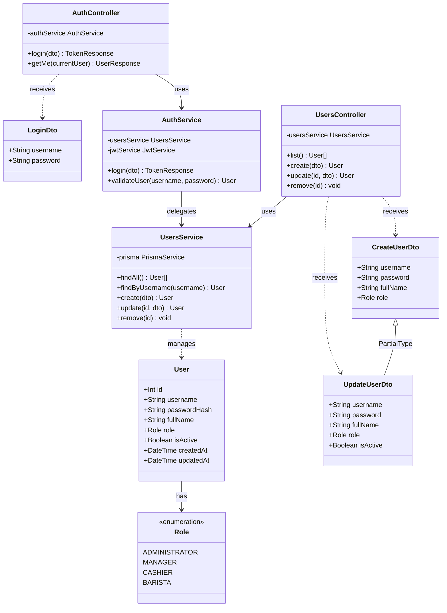
```mermaid
classDiagram
    class Role {
        <<enumeration>>
        ADMINISTRATOR
        MANAGER
        CASHIER
        BARISTA
    }

    class User {
        +Int id
        +String username
        +String passwordHash
        +String fullName
        +Role role
        +Boolean isActive
        +DateTime createdAt
        +DateTime updatedAt
    }

    class LoginDto {
        +String username
        +String password
    }

    class CreateUserDto {
        +String username
        +String password
        +String fullName
        +Role role
    }

    class UpdateUserDto {
        +String username
        +String password
        +String fullName
        +Role role
        +Boolean isActive
    }

    class AuthService {
        -usersService UsersService
        -jwtService JwtService
        +login(dto) TokenResponse
        +validateUser(username, password) User
    }

    class UsersService {
        -prisma PrismaService
        +findAll() User[]
        +findByUsername(username) User
        +create(dto) User
        +update(id, dto) User
        +remove(id) void
    }

    class AuthController {
        -authService AuthService
        +login(dto) TokenResponse
        +getMe(currentUser) UserResponse
    }

    class UsersController {
        -usersService UsersService
        +list() User[]
        +create(dto) User
        +update(id, dto) User
        +remove(id) void
    }

    User --> Role : has
    AuthController --> AuthService : uses
    AuthService --> UsersService : delegates
    UsersController --> UsersService : uses
    UsersService ..> User : manages
    AuthController ..> LoginDto : receives
    UsersController ..> CreateUserDto : receives
    UsersController ..> UpdateUserDto : receives
    CreateUserDto <|-- UpdateUserDto : PartialType
```

### Mobile

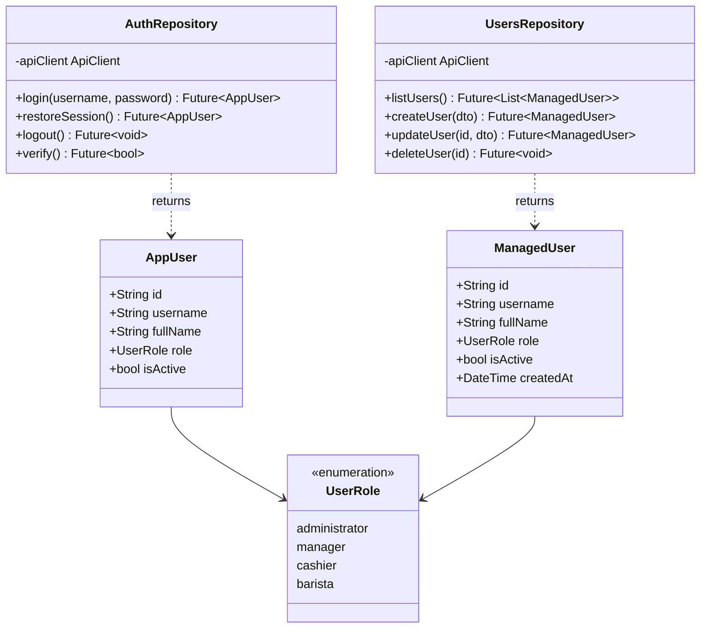
```mermaid
classDiagram
    class UserRole {
        <<enumeration>>
        administrator
        manager
        cashier
        barista
    }

    class AppUser {
        +String id
        +String username
        +String fullName
        +UserRole role
        +bool isActive
    }

    class ManagedUser {
        +String id
        +String username
        +String fullName
        +UserRole role
        +bool isActive
        +DateTime createdAt
    }

    class AuthRepository {
        -apiClient ApiClient
        +login(username, password) Future~AppUser~
        +restoreSession() Future~AppUser~
        +logout() Future~void~
        +verify() Future~bool~
    }

    class UsersRepository {
        -apiClient ApiClient
        +listUsers() Future~List~ManagedUser~~
        +createUser(dto) Future~ManagedUser~
        +updateUser(id, dto) Future~ManagedUser~
        +deleteUser(id) Future~void~
    }

    AppUser --> UserRole
    ManagedUser --> UserRole
    AuthRepository ..> AppUser : returns
    UsersRepository ..> ManagedUser : returns
```

---

## Feature 2 · Menu (Sản phẩm & Danh mục)

**Scope:** `MenuModule` — CRUD Category, CRUD Product, quản lý recipe (ProductIngredient cho BR-08).

### Backend

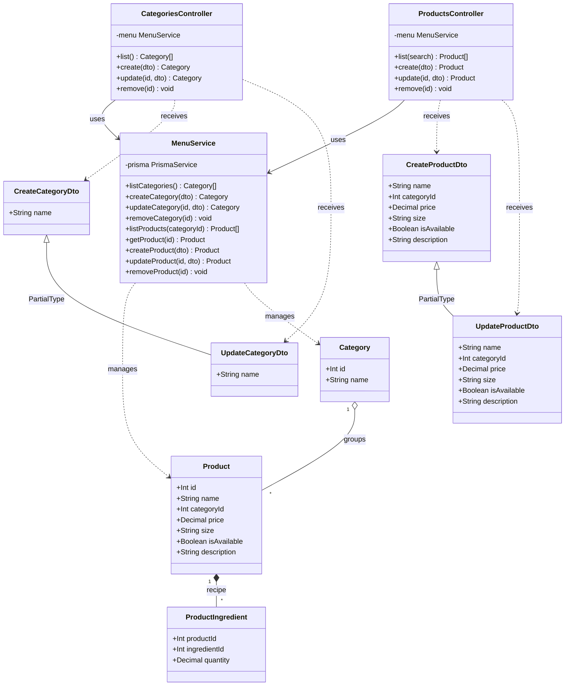
```mermaid
classDiagram
    class Category {
        +Int id
        +String name
    }

    class Product {
        +Int id
        +String name
        +Int categoryId
        +Decimal price
        +String size
        +Boolean isAvailable
        +String description
    }

    class ProductIngredient {
        +Int productId
        +Int ingredientId
        +Decimal quantity
    }

    class CreateCategoryDto {
        +String name
    }

    class UpdateCategoryDto {
        +String name
    }

    class CreateProductDto {
        +String name
        +Int categoryId
        +Decimal price
        +String size
        +Boolean isAvailable
        +String description
    }

    class UpdateProductDto {
        +String name
        +Int categoryId
        +Decimal price
        +String size
        +Boolean isAvailable
        +String description
    }

    class MenuService {
        -prisma PrismaService
        +listCategories() Category[]
        +createCategory(dto) Category
        +updateCategory(id, dto) Category
        +removeCategory(id) void
        +listProducts(categoryId) Product[]
        +getProduct(id) Product
        +createProduct(dto) Product
        +updateProduct(id, dto) Product
        +removeProduct(id) void
    }

    class ProductsController {
        -menu MenuService
        +list(search) Product[]
        +create(dto) Product
        +update(id, dto) Product
        +remove(id) void
    }

    class CategoriesController {
        -menu MenuService
        +list() Category[]
        +create(dto) Category
        +update(id, dto) Category
        +remove(id) void
    }

    Category "1" o-- "*" Product : groups
    Product "1" *-- "*" ProductIngredient : recipe
    ProductsController --> MenuService : uses
    CategoriesController --> MenuService : uses
    MenuService ..> Product : manages
    MenuService ..> Category : manages
    ProductsController ..> CreateProductDto : receives
    ProductsController ..> UpdateProductDto : receives
    CategoriesController ..> CreateCategoryDto : receives
    CategoriesController ..> UpdateCategoryDto : receives
    CreateProductDto <|-- UpdateProductDto : PartialType
    CreateCategoryDto <|-- UpdateCategoryDto : PartialType
```

### Mobile

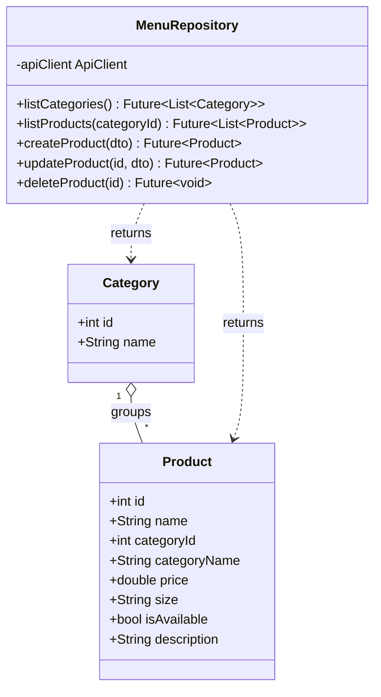
```mermaid
classDiagram
    class Category {
        +int id
        +String name
    }

    class Product {
        +int id
        +String name
        +int categoryId
        +String categoryName
        +double price
        +String size
        +bool isAvailable
        +String description
    }

    class MenuRepository {
        -apiClient ApiClient
        +listCategories() Future~List~Category~~
        +listProducts(categoryId) Future~List~Product~~
        +createProduct(dto) Future~Product~
        +updateProduct(id, dto) Future~Product~
        +deleteProduct(id) Future~void~
    }

    Category "1" o-- "*" Product : groups
    MenuRepository ..> Product : returns
    MenuRepository ..> Category : returns
```

---

## Feature 3 · Quản lý Bàn

**Scope:** `TablesModule` — CRUD bàn, theo dõi tình trạng bàn (FREE / OCCUPIED / RESERVED).

### Backend

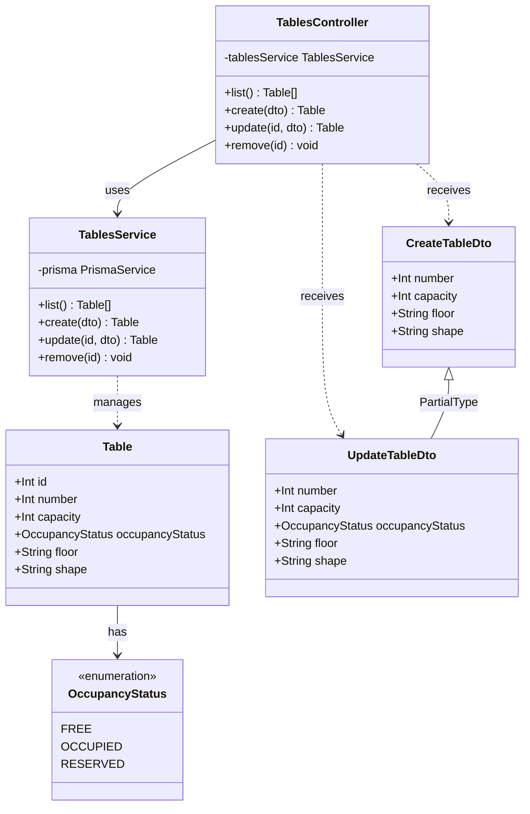
```mermaid
classDiagram
    class OccupancyStatus {
        <<enumeration>>
        FREE
        OCCUPIED
        RESERVED
    }

    class Table {
        +Int id
        +Int number
        +Int capacity
        +OccupancyStatus occupancyStatus
        +String floor
        +String shape
    }

    class CreateTableDto {
        +Int number
        +Int capacity
        +String floor
        +String shape
    }

    class UpdateTableDto {
        +Int number
        +Int capacity
        +OccupancyStatus occupancyStatus
        +String floor
        +String shape
    }

    class TablesService {
        -prisma PrismaService
        +list() Table[]
        +create(dto) Table
        +update(id, dto) Table
        +remove(id) void
    }

    class TablesController {
        -tablesService TablesService
        +list() Table[]
        +create(dto) Table
        +update(id, dto) Table
        +remove(id) void
    }

    Table --> OccupancyStatus : has
    TablesController --> TablesService : uses
    TablesService ..> Table : manages
    TablesController ..> CreateTableDto : receives
    TablesController ..> UpdateTableDto : receives
    CreateTableDto <|-- UpdateTableDto : PartialType
```

### Mobile

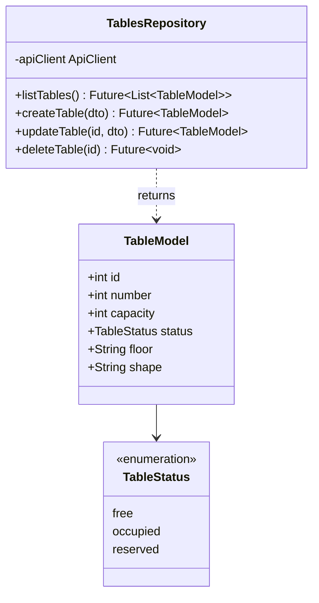
```mermaid
classDiagram
    class TableStatus {
        <<enumeration>>
        free
        occupied
        reserved
    }

    class TableModel {
        +int id
        +int number
        +int capacity
        +TableStatus status
        +String floor
        +String shape
    }

    class TablesRepository {
        -apiClient ApiClient
        +listTables() Future~List~TableModel~~
        +createTable(dto) Future~TableModel~
        +updateTable(id, dto) Future~TableModel~
        +deleteTable(id) Future~void~
    }

    TableModel --> TableStatus
    TablesRepository ..> TableModel : returns
```

---

## Feature 4 · Đơn hàng & Chuẩn bị món

**Scope:** `OrdersModule` — tạo order, cập nhật trạng thái, queue barista, prep flow theo PrepStatus.

### Backend

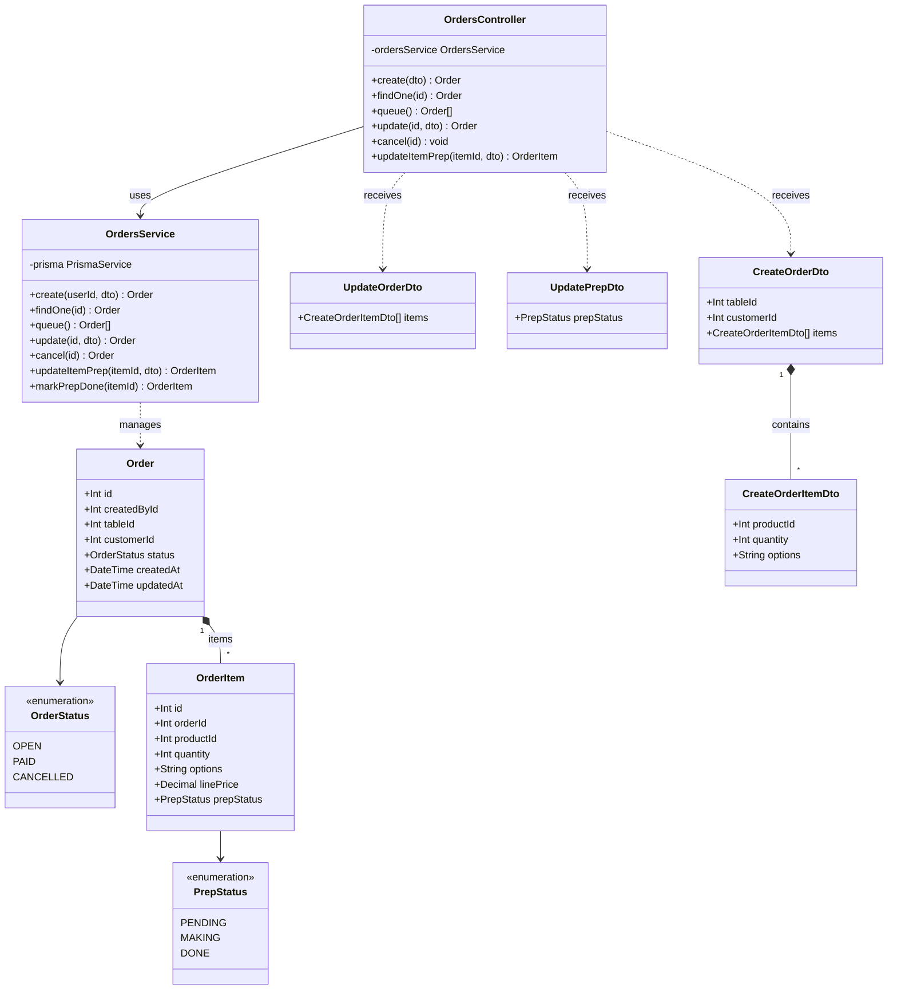
```mermaid
classDiagram
    class OrderStatus {
        <<enumeration>>
        OPEN
        PAID
        CANCELLED
    }

    class PrepStatus {
        <<enumeration>>
        PENDING
        MAKING
        DONE
    }

    class Order {
        +Int id
        +Int createdById
        +Int tableId
        +Int customerId
        +OrderStatus status
        +DateTime createdAt
        +DateTime updatedAt
    }

    class OrderItem {
        +Int id
        +Int orderId
        +Int productId
        +Int quantity
        +String options
        +Decimal linePrice
        +PrepStatus prepStatus
    }

    class CreateOrderItemDto {
        +Int productId
        +Int quantity
        +String options
    }

    class CreateOrderDto {
        +Int tableId
        +Int customerId
        +CreateOrderItemDto[] items
    }

    class UpdateOrderDto {
        +CreateOrderItemDto[] items
    }

    class UpdatePrepDto {
        +PrepStatus prepStatus
    }

    class OrdersService {
        -prisma PrismaService
        +create(userId, dto) Order
        +findOne(id) Order
        +queue() Order[]
        +update(id, dto) Order
        +cancel(id) Order
        +updateItemPrep(itemId, dto) OrderItem
        +markPrepDone(itemId) OrderItem
    }

    class OrdersController {
        -ordersService OrdersService
        +create(dto) Order
        +findOne(id) Order
        +queue() Order[]
        +update(id, dto) Order
        +cancel(id) void
        +updateItemPrep(itemId, dto) OrderItem
    }

    Order --> OrderStatus
    Order "1" *-- "*" OrderItem : items
    OrderItem --> PrepStatus
    OrdersController --> OrdersService : uses
    OrdersService ..> Order : manages
    OrdersController ..> CreateOrderDto : receives
    OrdersController ..> UpdateOrderDto : receives
    OrdersController ..> UpdatePrepDto : receives
    CreateOrderDto "1" *-- "*" CreateOrderItemDto : contains
```

### Mobile

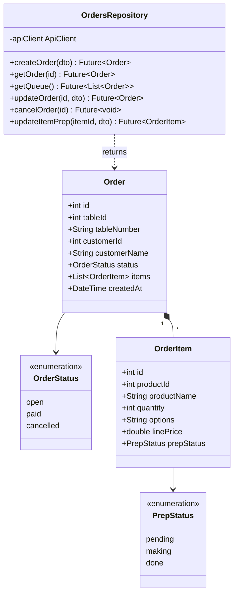
```mermaid
classDiagram
    class OrderStatus {
        <<enumeration>>
        open
        paid
        cancelled
    }

    class PrepStatus {
        <<enumeration>>
        pending
        making
        done
    }

    class OrderItem {
        +int id
        +int productId
        +String productName
        +int quantity
        +String options
        +double linePrice
        +PrepStatus prepStatus
    }

    class Order {
        +int id
        +int tableId
        +String tableNumber
        +int customerId
        +String customerName
        +OrderStatus status
        +List~OrderItem~ items
        +DateTime createdAt
    }

    class OrdersRepository {
        -apiClient ApiClient
        +createOrder(dto) Future~Order~
        +getOrder(id) Future~Order~
        +getQueue() Future~List~Order~~
        +updateOrder(id, dto) Future~Order~
        +cancelOrder(id) Future~void~
        +updateItemPrep(itemId, dto) Future~OrderItem~
    }

    Order --> OrderStatus
    Order "1" *-- "*" OrderItem
    OrderItem --> PrepStatus
    OrdersRepository ..> Order : returns
```

---

## Feature 5 · Thanh toán & Loyalty

**Scope:** `PaymentsModule` — xử lý thanh toán, áp dụng BR-06 (discount), BR-08 (trừ kho), BR-11 (loyalty points).

### Backend

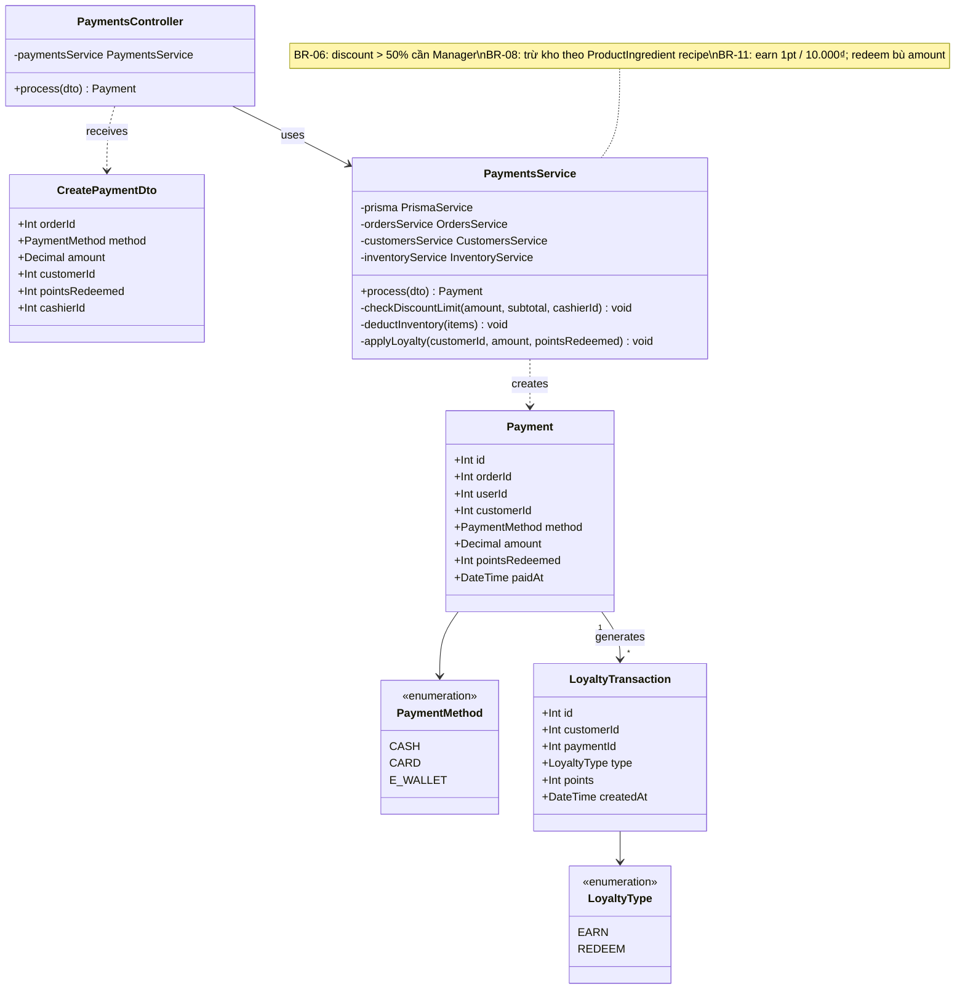
```mermaid
classDiagram
    class PaymentMethod {
        <<enumeration>>
        CASH
        CARD
        E_WALLET
    }

    class LoyaltyType {
        <<enumeration>>
        EARN
        REDEEM
    }

    class Payment {
        +Int id
        +Int orderId
        +Int userId
        +Int customerId
        +PaymentMethod method
        +Decimal amount
        +Int pointsRedeemed
        +DateTime paidAt
    }

    class LoyaltyTransaction {
        +Int id
        +Int customerId
        +Int paymentId
        +LoyaltyType type
        +Int points
        +DateTime createdAt
    }

    class CreatePaymentDto {
        +Int orderId
        +PaymentMethod method
        +Decimal amount
        +Int customerId
        +Int pointsRedeemed
        +Int cashierId
    }

    class PaymentsService {
        -prisma PrismaService
        -ordersService OrdersService
        -customersService CustomersService
        -inventoryService InventoryService
        +process(dto) Payment
        -checkDiscountLimit(amount, subtotal, cashierId) void
        -deductInventory(items) void
        -applyLoyalty(customerId, amount, pointsRedeemed) void
    }

    class PaymentsController {
        -paymentsService PaymentsService
        +process(dto) Payment
    }

    Payment --> PaymentMethod
    Payment "1" --> "*" LoyaltyTransaction : generates
    LoyaltyTransaction --> LoyaltyType
    PaymentsController --> PaymentsService : uses
    PaymentsService ..> Payment : creates
    PaymentsController ..> CreatePaymentDto : receives

    note for PaymentsService "BR-06: discount > 50% cần Manager\nBR-08: trừ kho theo ProductIngredient recipe\nBR-11: earn 1pt / 10.000₫; redeem bù amount"
```

### Mobile

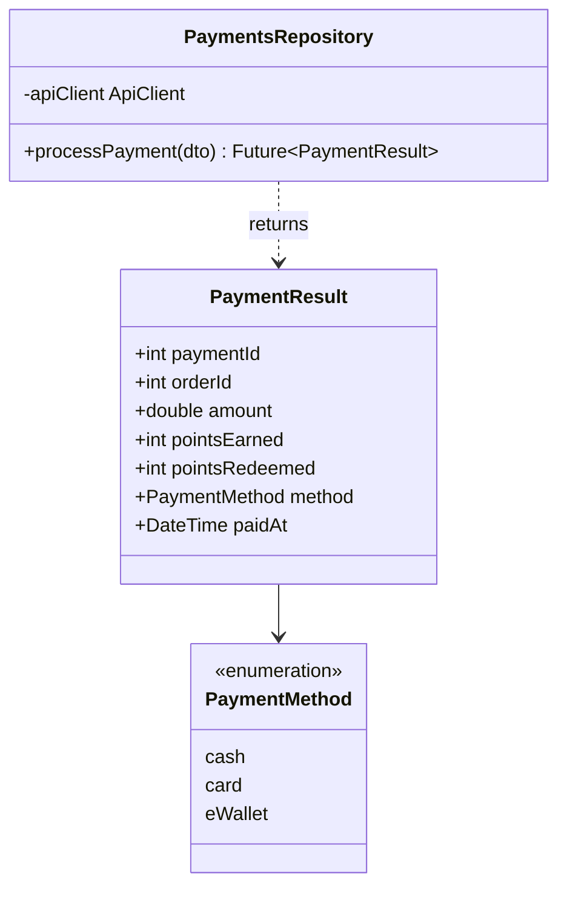
```mermaid
classDiagram
    class PaymentMethod {
        <<enumeration>>
        cash
        card
        eWallet
    }

    class PaymentResult {
        +int paymentId
        +int orderId
        +double amount
        +int pointsEarned
        +int pointsRedeemed
        +PaymentMethod method
        +DateTime paidAt
    }

    class PaymentsRepository {
        -apiClient ApiClient
        +processPayment(dto) Future~PaymentResult~
    }

    PaymentResult --> PaymentMethod
    PaymentsRepository ..> PaymentResult : returns
```

---

## Feature 6 · Nguyên liệu & Kho

**Scope:** `InventoryModule` — CRUD Ingredient, nhập kho (StockIn + PurchaseOrder), cảnh báo low-stock.

### Backend

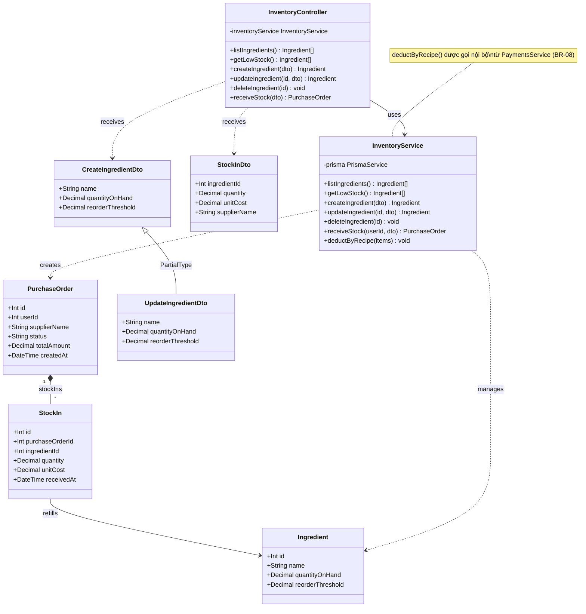
```mermaid
classDiagram
    class Ingredient {
        +Int id
        +String name
        +Decimal quantityOnHand
        +Decimal reorderThreshold
    }

    class PurchaseOrder {
        +Int id
        +Int userId
        +String supplierName
        +String status
        +Decimal totalAmount
        +DateTime createdAt
    }

    class StockIn {
        +Int id
        +Int purchaseOrderId
        +Int ingredientId
        +Decimal quantity
        +Decimal unitCost
        +DateTime receivedAt
    }

    class CreateIngredientDto {
        +String name
        +Decimal quantityOnHand
        +Decimal reorderThreshold
    }

    class UpdateIngredientDto {
        +String name
        +Decimal quantityOnHand
        +Decimal reorderThreshold
    }

    class StockInDto {
        +Int ingredientId
        +Decimal quantity
        +Decimal unitCost
        +String supplierName
    }

    class InventoryService {
        -prisma PrismaService
        +listIngredients() Ingredient[]
        +getLowStock() Ingredient[]
        +createIngredient(dto) Ingredient
        +updateIngredient(id, dto) Ingredient
        +deleteIngredient(id) void
        +receiveStock(userId, dto) PurchaseOrder
        +deductByRecipe(items) void
    }

    class InventoryController {
        -inventoryService InventoryService
        +listIngredients() Ingredient[]
        +getLowStock() Ingredient[]
        +createIngredient(dto) Ingredient
        +updateIngredient(id, dto) Ingredient
        +deleteIngredient(id) void
        +receiveStock(dto) PurchaseOrder
    }

    PurchaseOrder "1" *-- "*" StockIn : stockIns
    StockIn --> Ingredient : refills
    InventoryController --> InventoryService : uses
    InventoryService ..> Ingredient : manages
    InventoryService ..> PurchaseOrder : creates
    InventoryController ..> CreateIngredientDto : receives
    InventoryController ..> StockInDto : receives
    CreateIngredientDto <|-- UpdateIngredientDto : PartialType

    note for InventoryService "deductByRecipe() được gọi nội bộ\ntừ PaymentsService (BR-08)"
```

### Mobile

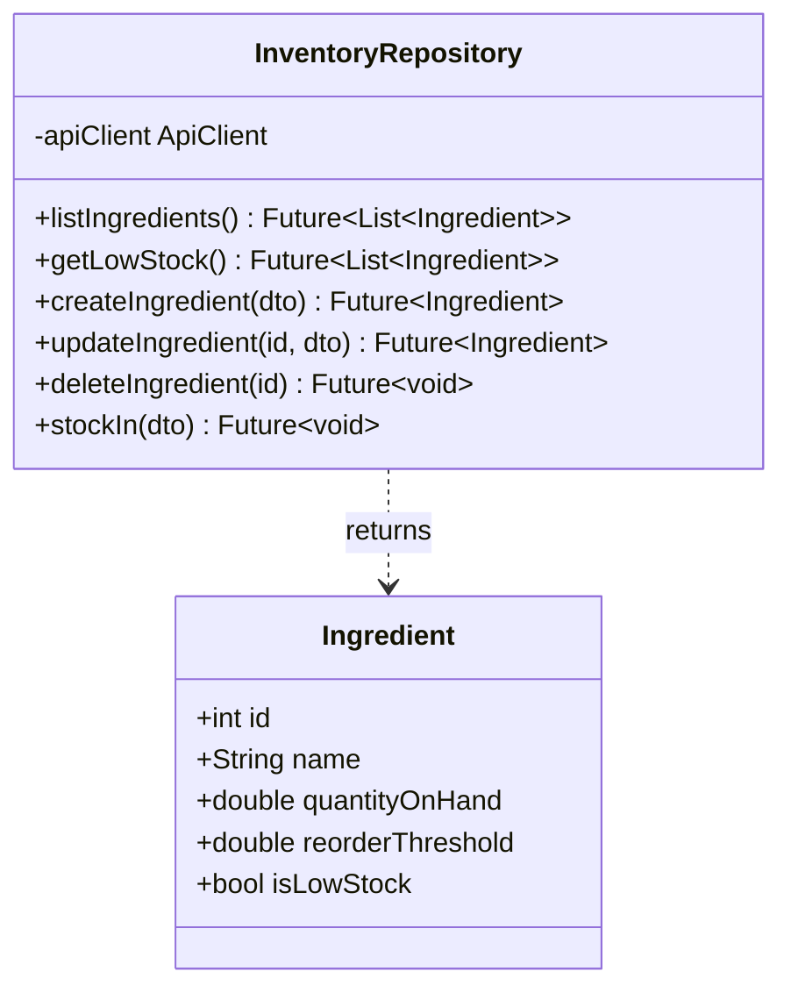
```mermaid
classDiagram
    class Ingredient {
        +int id
        +String name
        +double quantityOnHand
        +double reorderThreshold
        +bool isLowStock
    }

    class InventoryRepository {
        -apiClient ApiClient
        +listIngredients() Future~List~Ingredient~~
        +getLowStock() Future~List~Ingredient~~
        +createIngredient(dto) Future~Ingredient~
        +updateIngredient(id, dto) Future~Ingredient~
        +deleteIngredient(id) Future~void~
        +stockIn(dto) Future~void~
    }

    InventoryRepository ..> Ingredient : returns
```

---

## Feature 7 · Khách hàng

**Scope:** `CustomersModule` — CRUD khách hàng, xem lịch sử loyalty points.

### Backend

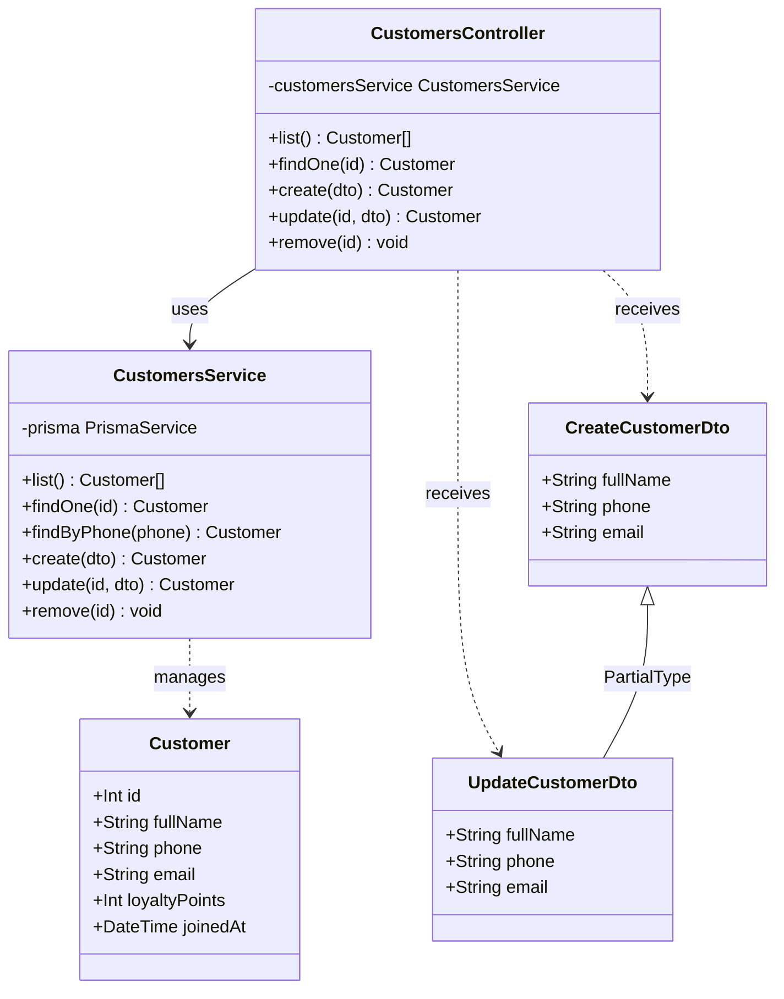
```mermaid
classDiagram
    class Customer {
        +Int id
        +String fullName
        +String phone
        +String email
        +Int loyaltyPoints
        +DateTime joinedAt
    }

    class CreateCustomerDto {
        +String fullName
        +String phone
        +String email
    }

    class UpdateCustomerDto {
        +String fullName
        +String phone
        +String email
    }

    class CustomersService {
        -prisma PrismaService
        +list() Customer[]
        +findOne(id) Customer
        +findByPhone(phone) Customer
        +create(dto) Customer
        +update(id, dto) Customer
        +remove(id) void
    }

    class CustomersController {
        -customersService CustomersService
        +list() Customer[]
        +findOne(id) Customer
        +create(dto) Customer
        +update(id, dto) Customer
        +remove(id) void
    }

    CustomersController --> CustomersService : uses
    CustomersService ..> Customer : manages
    CustomersController ..> CreateCustomerDto : receives
    CustomersController ..> UpdateCustomerDto : receives
    CreateCustomerDto <|-- UpdateCustomerDto : PartialType
```

### Mobile

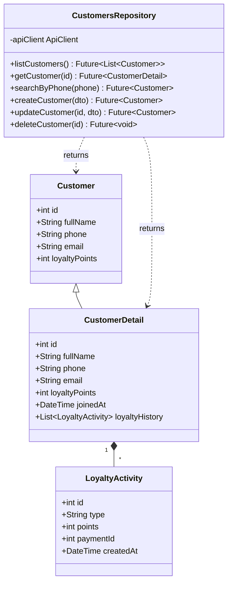
```mermaid
classDiagram
    class LoyaltyActivity {
        +int id
        +String type
        +int points
        +int paymentId
        +DateTime createdAt
    }

    class CustomerDetail {
        +int id
        +String fullName
        +String phone
        +String email
        +int loyaltyPoints
        +DateTime joinedAt
        +List~LoyaltyActivity~ loyaltyHistory
    }

    class Customer {
        +int id
        +String fullName
        +String phone
        +String email
        +int loyaltyPoints
    }

    class CustomersRepository {
        -apiClient ApiClient
        +listCustomers() Future~List~Customer~~
        +getCustomer(id) Future~CustomerDetail~
        +searchByPhone(phone) Future~Customer~
        +createCustomer(dto) Future~Customer~
        +updateCustomer(id, dto) Future~Customer~
        +deleteCustomer(id) Future~void~
    }

    Customer <|-- CustomerDetail
    CustomerDetail "1" *-- "*" LoyaltyActivity
    CustomersRepository ..> Customer : returns
    CustomersRepository ..> CustomerDetail : returns
```

---

## Feature 8 · Báo cáo & Dashboard

**Scope:** `ReportsModule` — doanh thu theo ngày/tháng, top sản phẩm, dashboard KPI, export CSV. Không có Entity riêng — query trực tiếp qua Prisma.

### Backend

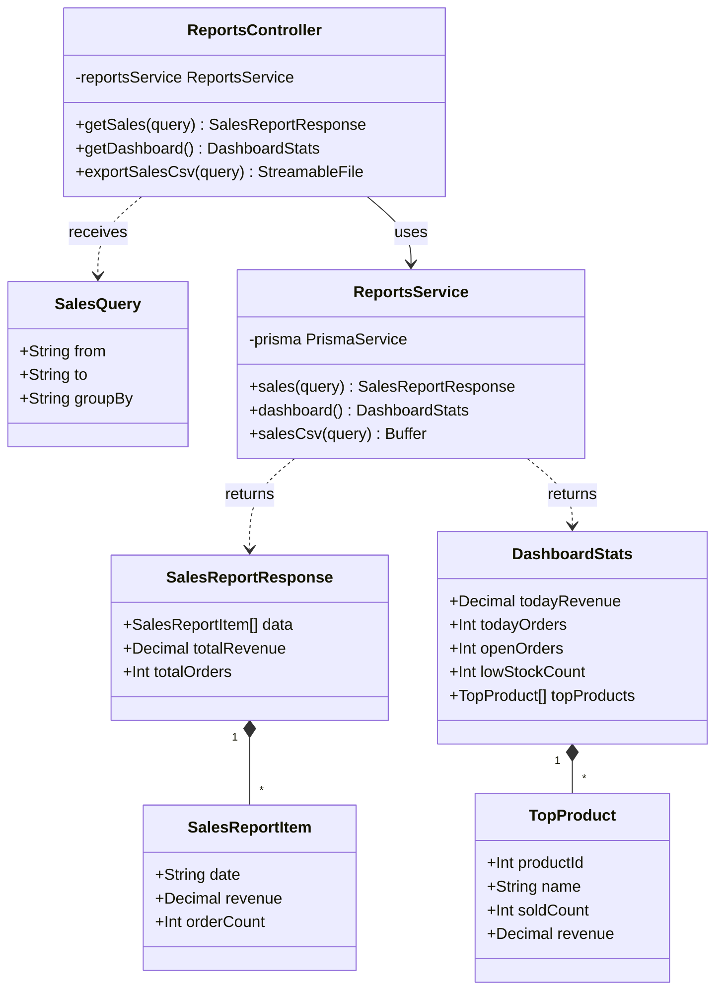
```mermaid
classDiagram
    class SalesQuery {
        +String from
        +String to
        +String groupBy
    }

    class SalesReportItem {
        +String date
        +Decimal revenue
        +Int orderCount
    }

    class SalesReportResponse {
        +SalesReportItem[] data
        +Decimal totalRevenue
        +Int totalOrders
    }

    class TopProduct {
        +Int productId
        +String name
        +Int soldCount
        +Decimal revenue
    }

    class DashboardStats {
        +Decimal todayRevenue
        +Int todayOrders
        +Int openOrders
        +Int lowStockCount
        +TopProduct[] topProducts
    }

    class ReportsService {
        -prisma PrismaService
        +sales(query) SalesReportResponse
        +dashboard() DashboardStats
        +salesCsv(query) Buffer
    }

    class ReportsController {
        -reportsService ReportsService
        +getSales(query) SalesReportResponse
        +getDashboard() DashboardStats
        +exportSalesCsv(query) StreamableFile
    }

    ReportsController --> ReportsService : uses
    ReportsService ..> SalesReportResponse : returns
    ReportsService ..> DashboardStats : returns
    ReportsController ..> SalesQuery : receives
    DashboardStats "1" *-- "*" TopProduct
    SalesReportResponse "1" *-- "*" SalesReportItem
```

### Mobile

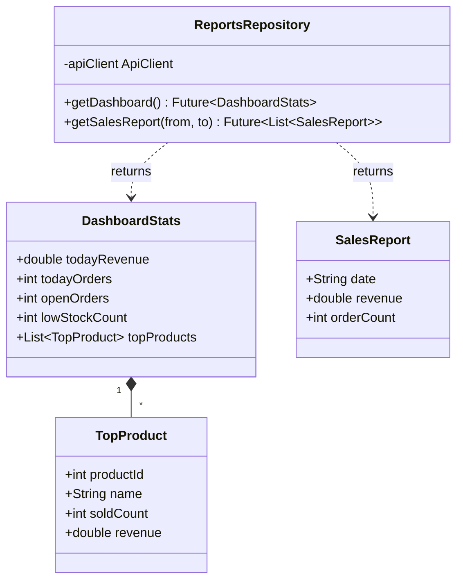
```mermaid
classDiagram
    class TopProduct {
        +int productId
        +String name
        +int soldCount
        +double revenue
    }

    class DashboardStats {
        +double todayRevenue
        +int todayOrders
        +int openOrders
        +int lowStockCount
        +List~TopProduct~ topProducts
    }

    class SalesReport {
        +String date
        +double revenue
        +int orderCount
    }

    class ReportsRepository {
        -apiClient ApiClient
        +getDashboard() Future~DashboardStats~
        +getSalesReport(from, to) Future~List~SalesReport~~
    }

    DashboardStats "1" *-- "*" TopProduct
    ReportsRepository ..> DashboardStats : returns
    ReportsRepository ..> SalesReport : returns
```

---

## Sơ đồ quan hệ giữa các Entity (ERD cô đọng)

Toàn bộ 13 Prisma entity và mối quan hệ:

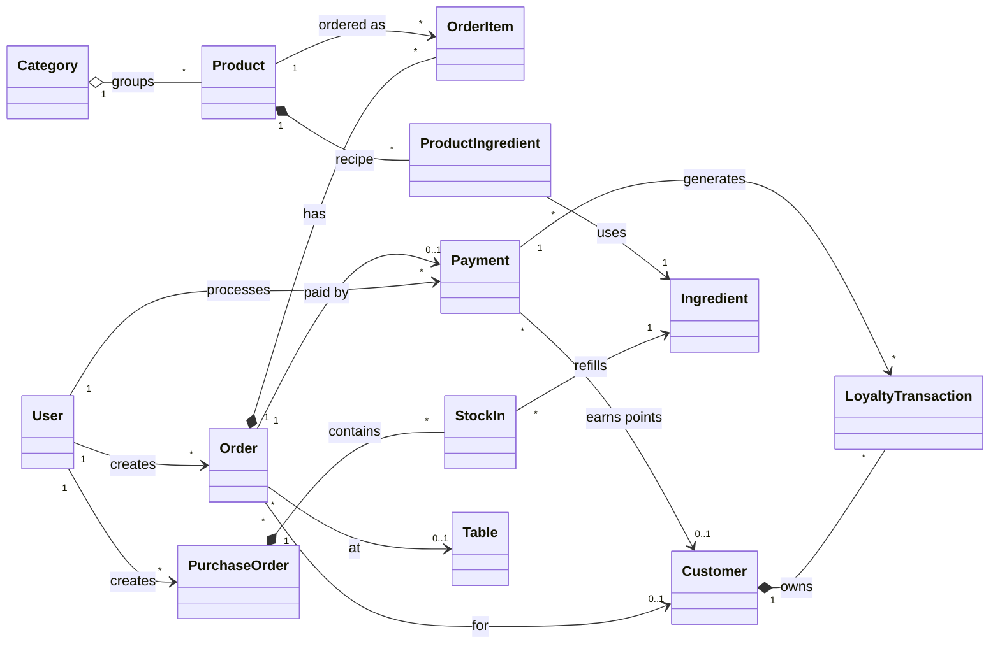
```mermaid
classDiagram
    direction LR

    %% Composition (filled diamond) — part is deleted with the whole
    Order "1" *-- "*" OrderItem : has
    Product "1" *-- "*" ProductIngredient : recipe
    PurchaseOrder "1" *-- "*" StockIn : contains
    Customer "1" *-- "*" LoyaltyTransaction : owns

    %% Aggregation (hollow diamond) — part lives independently
    Category "1" o-- "*" Product : groups

    %% Association (arrow) — reference
    User "1" --> "*" Order : creates
    User "1" --> "*" Payment : processes
    User "1" --> "*" PurchaseOrder : creates
    Product "1" --> "*" OrderItem : ordered as
    Order "1" --> "0..1" Payment : paid by
    Order "*" --> "0..1" Table : at
    Order "*" --> "0..1" Customer : for
    Payment "1" --> "*" LoyaltyTransaction : generates
    Payment "*" --> "0..1" Customer : earns points
    StockIn "*" --> "1" Ingredient : refills
    ProductIngredient "*" --> "1" Ingredient : uses
```
