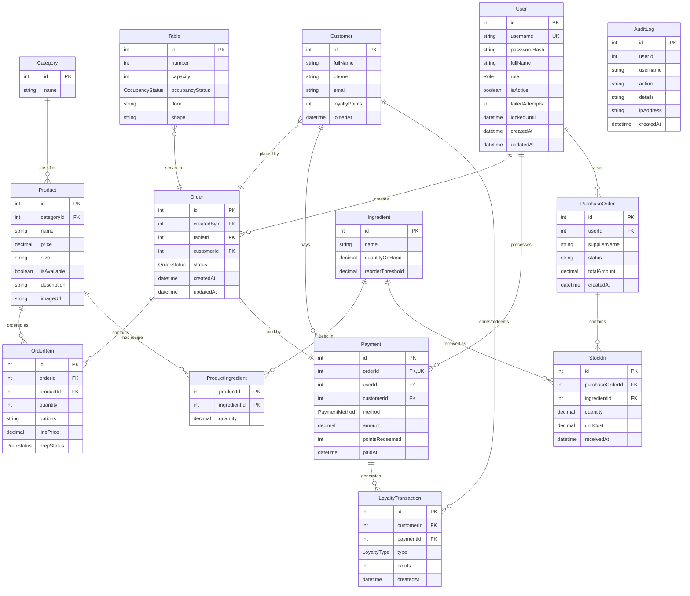
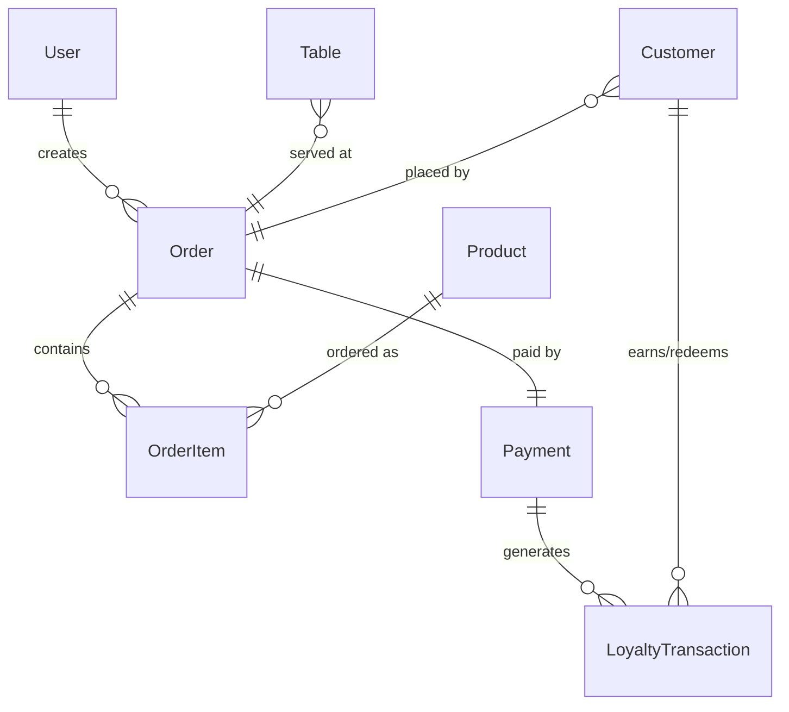
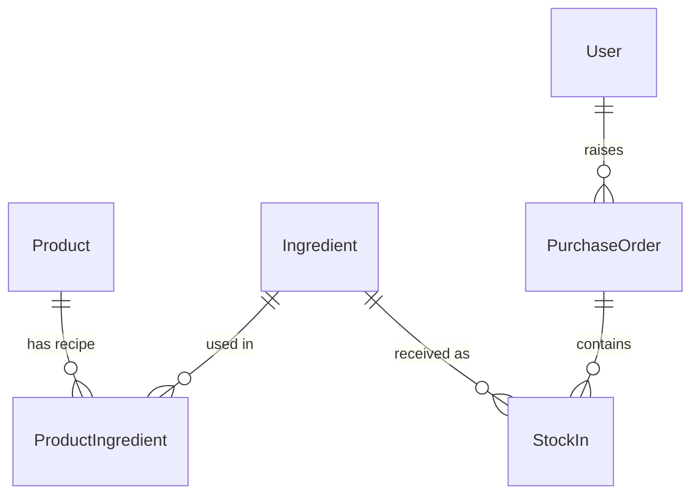

# CSMS — Entity Relationship Diagram

Sinh từ `backend/prisma/schema.prisma`. Khi schema đổi, cập nhật lại file này.

Ký hiệu quan hệ Mermaid:

| Ký hiệu | Nghĩa |
|---|---|
| `||--o{` | 1 — 0..n |
| `||--||` | 1 — 1 |
| `}o--||` | 0..n — 1 (FK nullable) |

---

## Sơ đồ tổng thể

---

## Cụm nghiệp vụ

### Bán hàng — order tới thanh toán

### Kho — công thức và nhập hàng

---

## Ghi chú

- `ProductIngredient` có khóa chính **cặp** `[productId, ingredientId]` — một nguyên liệu chỉ xuất
  hiện 1 lần trong công thức của mỗi món (BR-08).
- `Payment.orderId` là FK kèm `@unique` → quan hệ 1-1 với `Order` (BR-03: mỗi order một phương
  thức thanh toán) — trong sơ đồ ghi là `FK,UK`.
- `Order.tableId` null = takeaway; `Order.customerId` null = khách vãng lai.
- `AuditLog.userId` / `username` chỉ là snapshot, **không khai báo FK** tới `User` — cố ý, để log
  còn nguyên khi tài khoản bị xóa (CR-11).
- Tiền và số lượng dùng `Decimal(12,2)`; API trả JSON dạng string, client phải parse.
