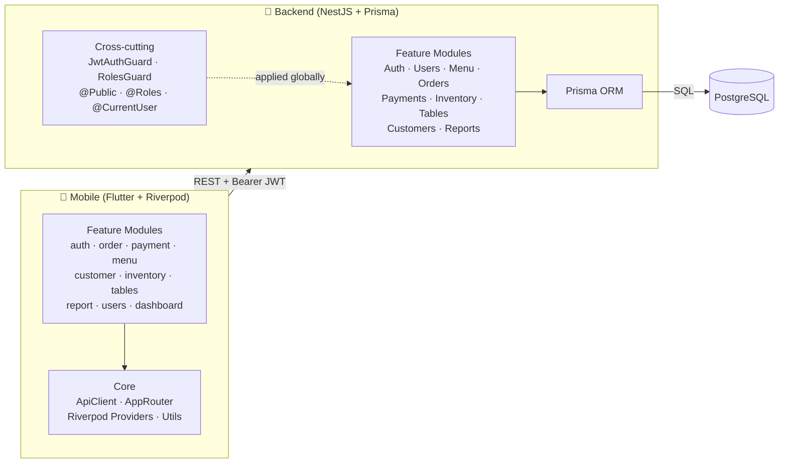
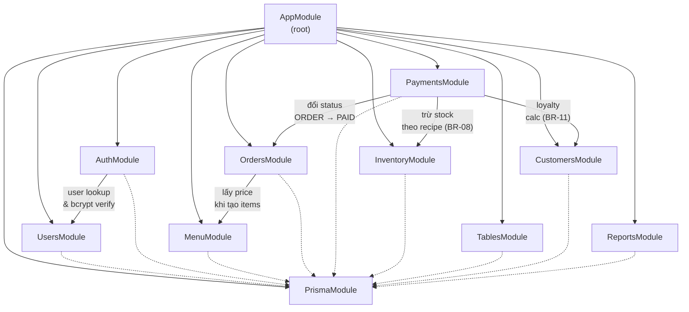
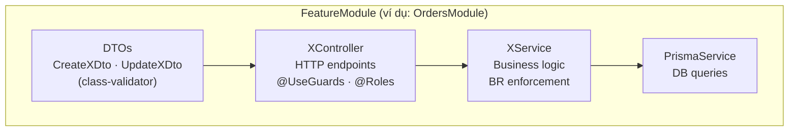
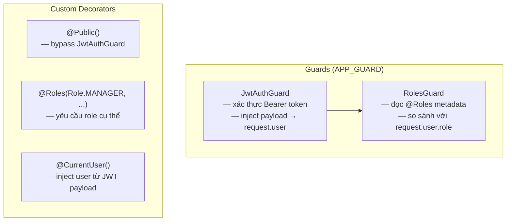
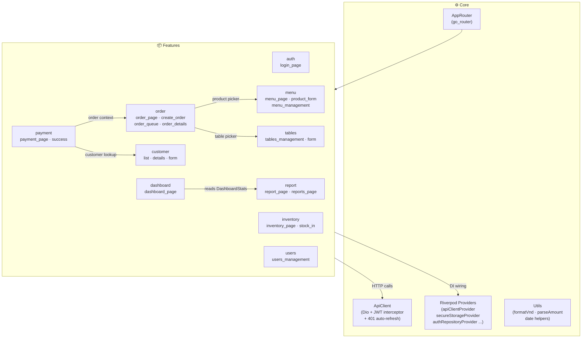
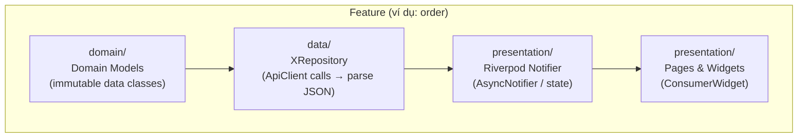

# CSMS — Package Diagram

> Biểu đồ package thể hiện cấu trúc tổ chức module cấp cao và mối quan hệ phụ thuộc giữa các thành phần.  
> **Backend:** NestJS 10 + Prisma 5 + PostgreSQL · **Mobile:** Flutter + Riverpod

---

## 1. Tổng quan hệ thống

---

## 2. Backend — NestJS Module Dependency Graph

Ký hiệu: `──►` import trực tiếp · `- -►` phụ thuộc PrismaModule (shared)

---

## 3. Backend — Cấu trúc nội bộ mỗi Module

Tất cả module tuân theo pattern 3 lớp:

---

## 4. Backend — Cross-cutting Concerns

---

## 5. Mobile — Feature & Dependency Graph

---

## 6. Mobile — Cấu trúc nội bộ mỗi Feature

Tất cả feature tuân theo pattern 3 lớp:

---

## 7. Bảng phụ thuộc quan trọng

| Phụ thuộc | Business Rule | Ghi chú |
|-----------|--------------|---------|
| `PaymentsModule` → `InventoryModule` | BR-08 | Tự động trừ kho theo recipe (`ProductIngredient`) khi order được thanh toán |
| `PaymentsModule` → `CustomersModule` | BR-11 | Earn 1 point / 10.000₫; redeem bù vào amount |
| `PaymentsModule` → `OrdersModule` | BR-07 | Chỉ đổi status `OPEN → PAID`; reject nếu đã PAID/CANCELLED |
| `AuthModule` → `UsersModule` | — | `findByUsername` + bcrypt compare khi login |
| `OrdersModule` → `MenuModule` | BR-04 | Lấy `price` + kiểm tra `isAvailable` khi thêm item |
| `payment` → `order` (mobile) | — | Hiển thị chi tiết đơn hàng trước khi xác nhận thanh toán |
| `order` → `menu` (mobile) | — | Product picker dùng danh sách menu khi tạo đơn |
| `order` → `tables` (mobile) | — | Table picker khi chọn bàn cho đơn dine-in |
