# CSMS — Sequence Diagrams

> Mỗi diagram mô tả luồng xử lý của một (hoặc một nhóm) Use Case theo **SRS §2.2.2**.
> Các tầng (lanes) phản ánh đúng kiến trúc backend NestJS:
>
> | Lane | Vai trò | Hiện thực trong code |
> |---|---|---|
> | **Mobile App** | UI Flutter + Repository (Dio) + Riverpod | `mobile/lib/features/*` |
> | **Controller (API)** | Route REST + `JwtAuthGuard`/`RolesGuard` + validate DTO | `*.controller.ts` |
> | **Service** | Business logic + Business Rules (BR-xx) + `$transaction` | `*.service.ts` |
> | **Prisma (Repo)** | Data-access / ORM (truy vấn type-safe) | `PrismaService` |
> | **PostgreSQL** | Lưu trữ dữ liệu | container `csms-db` |
>
> Backend **không có** lớp Repository riêng — Prisma đóng vai trò lớp data-access (repo), được inject thẳng vào Service.
>
> **Quy ước UML (sequence):**
> - Mỗi lifeline là một **object**; nếu là class thì viết `:ClassName` (dấu `:` đứng trước) — vd `:AuthController`, `:AuthService`, `:PrismaService`. **`:PostgreSQL`** cũng là **object** (data store) → KHÔNG vẽ bằng hình người que (actor).
> - **Actor** (`Cashier`, `Manager`, `Barista`, `Administrator`) là con người → hình người que.
> - Object của **mobile app** đặt đúng **tên ứng dụng**: `CSMS Mobile`.
> - Message dùng `->>+` / `-->>-` để Mermaid vẽ **thanh activation** (execution occurrence). **Self-message** (một object gọi chính nó) cũng **bắt buộc** hiện thanh activation lồng (thanh chữ nhật dài): viết `X->>+X: method()` rồi `X-->>-X: return`, không dùng `X->>X:` trơn.
> - Trong các diagram SD-01…SD-16, `CSMS Mobile` được coi là **một** lifeline (hộp đen). Luồng xử lý **bên trong** mobile app (UI → provider → repository → ApiClient) được tách thành **1 sequence diagram bổ sung: SD-00** ngay bên dưới.

---

## Đối chiếu số lượng diagram ↔ Use Case (SRS)

SRS §2.2.2 liệt kê **18 use case** (UC01–UC18). Tài liệu này dùng **16 sequence diagram** — phủ đủ 18 UC bằng cách:
> - **UC03 Authorize** là bước `«include»` chung của mọi use case nghiệp vụ (đã kiểm `JwtAuthGuard` + `RolesGuard` ở lane Controller), không tách diagram riêng.
> - Gộp các use case CRUD cùng một luồng (Add / Edit / Delete / View chung một diagram).

| # SD | Sequence Diagram | UC (SRS §2.2.2) phủ | Actor |
|---|---|---|---|
| SD-01 | Login / Logout | UC01, UC02 | All roles |
| SD-02 | Manage User | UC04 | Administrator |
| SD-03 | Create Order | UC05 | Cashier |
| SD-04 | Update Order | UC06 | Cashier |
| SD-05 | Cancel Order | UC07 | Cashier |
| SD-06 | Process Payment | UC08 | Cashier (+ Payment Gateway, + Manager) |
| SD-07 | View Order Queue | UC09 | Barista / Cashier / Manager |
| SD-08 | Update Item Prep Status | UC09 (prep flow) | Barista |
| SD-09 | Manage Product (Add / Edit / Delete / View) | UC10 | Manager |
| SD-10 | Manage Category (Add / Edit / Delete) | UC11 | Manager |
| SD-11 | Manage Ingredient (Add / Edit / Delete) | UC12 | Manager |
| SD-12 | Create Stock-In (Goods Receipt) | UC13 | Manager |
| SD-13 | View Inventory Report (+ Low-Stock) | UC14 | Manager |
| SD-14 | Manage Table (Add / Edit / Delete) | UC15 | Manager |
| SD-15 | Manage Customer (Add / Edit / Delete / View) | UC16 | Manager |
| SD-16 | View Sales Report + Export Report | UC17, UC18 | Manager |

**Tổng:** UC03 *Authorize* nằm trong mọi diagram nghiệp vụ (lane Controller); 16 diagram còn lại phủ 17 use case còn lại → **18/18 UC**. ✅ · Thêm **SD-00** (bổ sung) mô tả luồng **nội bộ mobile app** (frontend).

> Ghi chú: UC08 *Process Payment* trong SRS có actor phụ **Payment Gateway** (external). Bản build CSMS dùng **thanh toán giả lập** (không gọi gateway thật) — xem SD-06.

---

## SD-00 · Mobile App — luồng nội bộ (frontend) — *bổ sung*

> Trong SD-01…SD-16, `CSMS Mobile` là **một** lifeline. Diagram này **mở hộp đen đó ra**, mô tả luồng đi **bên trong** mobile app theo kiến trúc feature-first (presentation → application/provider → data → core/network). Lấy ví dụ thao tác **Create Order**.
>
> Các object mobile: `:CreateOrderPage` (presentation), `:ordersProvider` (Riverpod Notifier — application), `:OrdersRepository` (data), `:ApiClient` (core/network). Ranh giới ra ngoài là `Backend API`.
> Chú ý: mỗi **self-message** (object gọi chính nó) đều mở **thanh activation** lồng (`->>+X` … `X-->>-`).

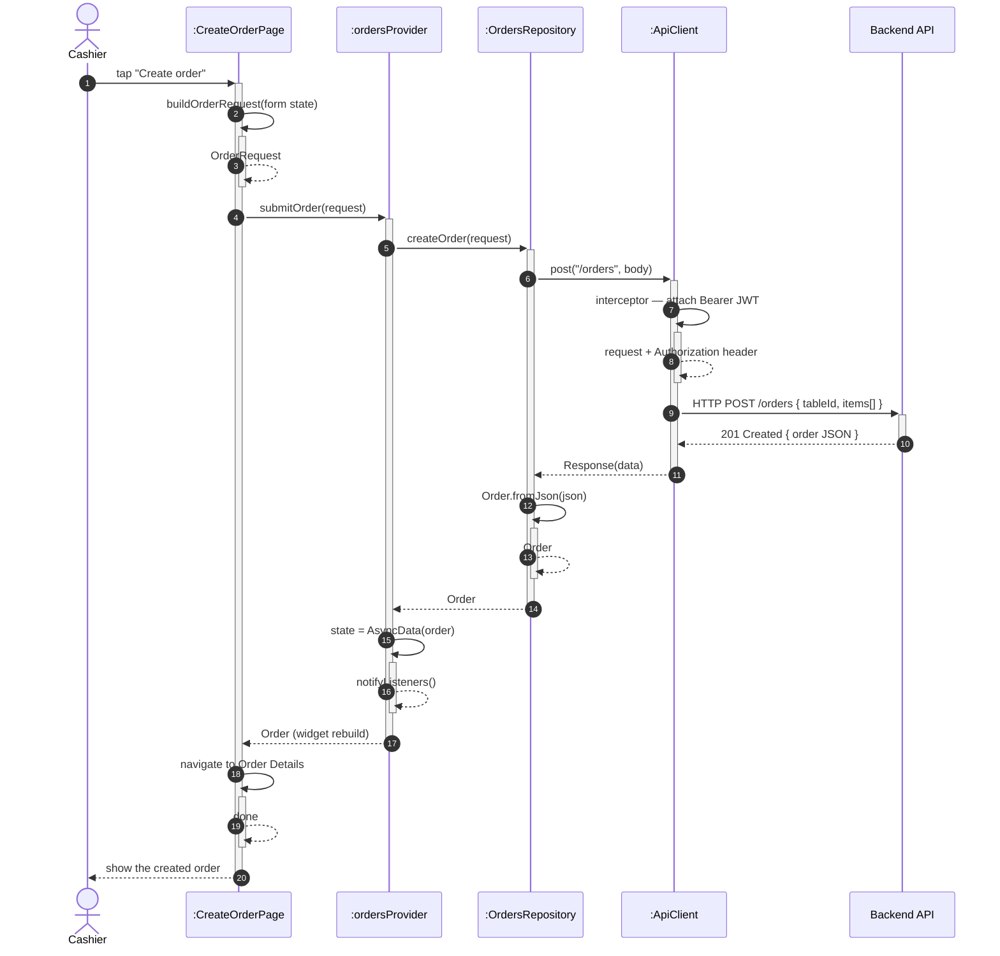
```mermaid
sequenceDiagram
    autonumber
    actor Cashier
    participant Page as :CreateOrderPage
    participant Prov as :ordersProvider
    participant Repo as :OrdersRepository
    participant Api as :ApiClient
    participant BE as Backend API

    Cashier->>+Page: tap "Create order"
    Page->>+Page: buildOrderRequest(form state)
    Page-->>-Page: OrderRequest
    Page->>+Prov: submitOrder(request)
    Prov->>+Repo: createOrder(request)
    Repo->>+Api: post("/orders", body)
    Api->>+Api: interceptor — attach Bearer JWT
    Api-->>-Api: request + Authorization header
    Api->>+BE: HTTP POST /orders { tableId, items[] }
    BE-->>-Api: 201 Created { order JSON }
    Api-->>-Repo: Response(data)
    Repo->>+Repo: Order.fromJson(json)
    Repo-->>-Repo: Order
    Repo-->>-Prov: Order
    Prov->>+Prov: state = AsyncData(order)
    Prov-->>-Prov: notifyListeners()
    Prov-->>-Page: Order (widget rebuild)
    Page->>+Page: navigate to Order Details
    Page-->>-Page: done
    Page-->>-Cashier: show the created order
```

> Cùng khuôn này áp dụng cho mọi feature khác (mở hộp đen `CSMS Mobile`): chỉ đổi `Page`/`Provider`/`Repository` tương ứng (vd `:PaymentPage → :paymentProvider → :PaymentsRepository → :ApiClient`).

---

## SD-01 · Login / Logout — `UC01, UC02`

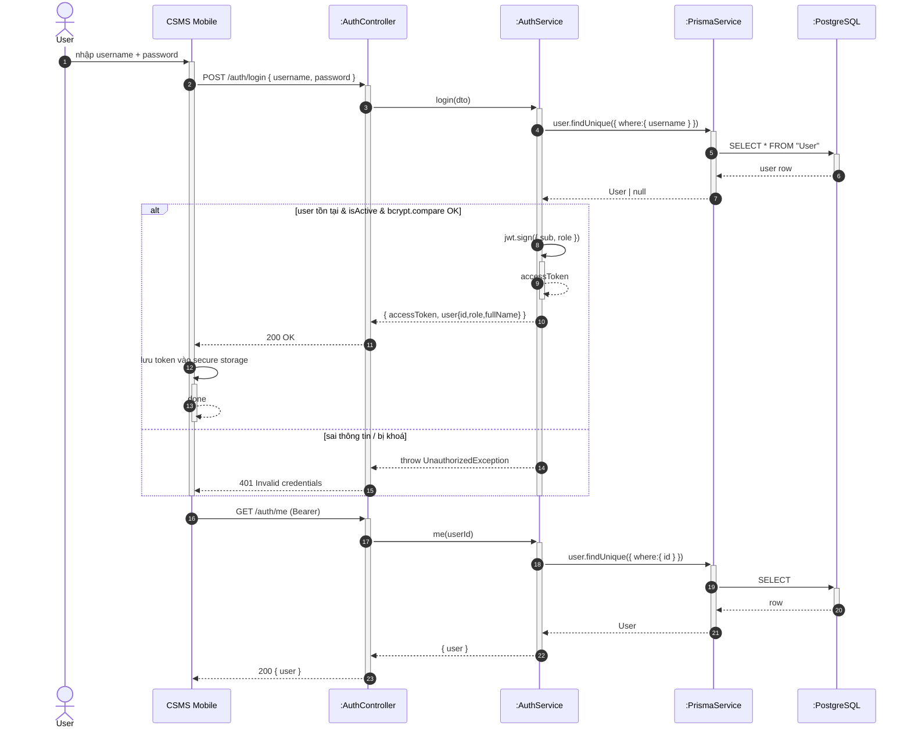
```mermaid
sequenceDiagram
    autonumber
    actor U as User
    participant App as CSMS Mobile
    participant API as :AuthController
    participant SVC as :AuthService
    participant ORM as :PrismaService
    participant DB as :PostgreSQL

    U->>+App: nhập username + password
    App->>+API: POST /auth/login { username, password }
    API->>+SVC: login(dto)
    SVC->>+ORM: user.findUnique({ where:{ username } })
    ORM->>+DB: SELECT * FROM "User"
    DB-->>-ORM: user row
    ORM-->>-SVC: User | null
    alt user tồn tại & isActive & bcrypt.compare OK
        SVC->>+SVC: jwt.sign({ sub, role })
        SVC-->>-SVC: accessToken
        SVC-->>API: { accessToken, user{id,role,fullName} }
        API-->>App: 200 OK
        App->>+App: lưu token vào secure storage
        App-->>-App: done
    else sai thông tin / bị khoá
        SVC-->>API: throw UnauthorizedException
        API-->>App: 401 Invalid credentials
    end
    deactivate SVC
    deactivate API
    deactivate App

    App->>+API: GET /auth/me (Bearer)
    API->>+SVC: me(userId)
    SVC->>+ORM: user.findUnique({ where:{ id } })
    ORM->>+DB: SELECT
    DB-->>-ORM: row
    ORM-->>-SVC: User
    SVC-->>-API: { user }
    API-->>-App: 200 { user }
```

---

## SD-02 · Manage User (Add / Edit / Delete / Assign Role) — `UC04`

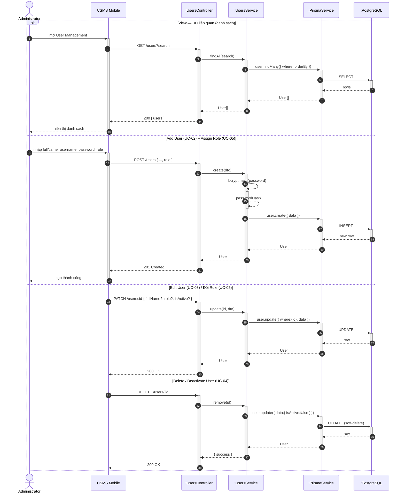
```mermaid
sequenceDiagram
    autonumber
    actor A as Administrator
    participant App as CSMS Mobile
    participant API as :UsersController
    participant SVC as :UsersService
    participant ORM as :PrismaService
    participant DB as :PostgreSQL

    alt View — UC liên quan (danh sách)
        A->>+App: mở User Management
        App->>+API: GET /users?search
        API->>+SVC: findAll(search)
        SVC->>+ORM: user.findMany({ where, orderBy })
        ORM->>+DB: SELECT
        DB-->>-ORM: rows
        ORM-->>-SVC: User[]
        SVC-->>-API: User[]
        API-->>-App: 200 [ users ]
        App-->>-A: hiển thị danh sách
    else Add User (UC-02) + Assign Role (UC-05)
        A->>+App: nhập fullName, username, password, role
        App->>+API: POST /users { ..., role }
        API->>+SVC: create(dto)
        SVC->>+SVC: bcrypt.hash(password)
        SVC-->>-SVC: passwordHash
        SVC->>+ORM: user.create({ data })
        ORM->>+DB: INSERT
        DB-->>-ORM: new row
        ORM-->>-SVC: User
        SVC-->>-API: User
        API-->>-App: 201 Created
        App-->>-A: tạo thành công
    else Edit User (UC-03) / Đổi Role (UC-05)
        App->>+API: PATCH /users/:id { fullName?, role?, isActive? }
        API->>+SVC: update(id, dto)
        SVC->>+ORM: user.update({ where:{id}, data })
        ORM->>+DB: UPDATE
        DB-->>-ORM: row
        ORM-->>-SVC: User
        SVC-->>-API: User
        API-->>-App: 200 OK
    else Delete / Deactivate User (UC-04)
        App->>+API: DELETE /users/:id
        API->>+SVC: remove(id)
        SVC->>+ORM: user.update({ data:{ isActive:false } })
        ORM->>+DB: UPDATE (soft-delete)
        DB-->>-ORM: row
        ORM-->>-SVC: User
        SVC-->>-API: { success }
        API-->>-App: 200 OK
    end
```

> **Gán role** không có endpoint riêng — được hiện thực qua trường `role` trong DTO của *Add User* và *Edit User* (nằm trong UC04 *Manage User*).

---

## SD-03 · Create Order (+ Assign Table) — `UC05`

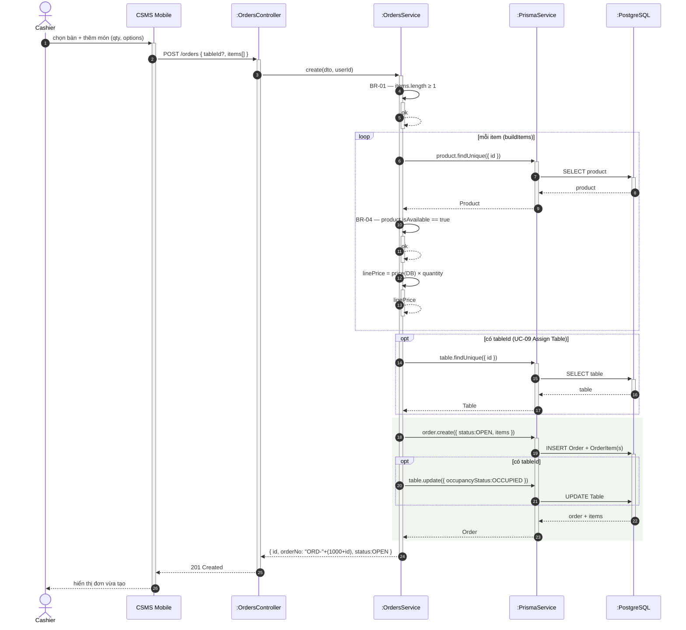
```mermaid
sequenceDiagram
    autonumber
    actor C as Cashier
    participant App as CSMS Mobile
    participant API as :OrdersController
    participant SVC as :OrdersService
    participant ORM as :PrismaService
    participant DB as :PostgreSQL

    C->>+App: chọn bàn + thêm món (qty, options)
    App->>+API: POST /orders { tableId?, items[] }
    API->>+SVC: create(dto, userId)

    SVC->>+SVC: BR-01 — items.length ≥ 1
    SVC-->>-SVC: ok
    loop mỗi item (buildItems)
        SVC->>+ORM: product.findUnique({ id })
        ORM->>+DB: SELECT product
        DB-->>-ORM: product
        ORM-->>-SVC: Product
        SVC->>+SVC: BR-04 — product.isAvailable == true
        SVC-->>-SVC: ok
        SVC->>+SVC: linePrice = price(DB) × quantity
        SVC-->>-SVC: linePrice
    end

    opt có tableId (UC-09 Assign Table)
        SVC->>+ORM: table.findUnique({ id })
        ORM->>+DB: SELECT table
        DB-->>-ORM: table
        ORM-->>-SVC: Table
    end

    rect rgb(238,246,238)
        SVC->>+ORM: order.create({ status:OPEN, items })
        ORM->>+DB: INSERT Order + OrderItem(s)
        opt có tableId
            SVC->>ORM: table.update({ occupancyStatus:OCCUPIED })
            ORM->>DB: UPDATE Table
        end
        DB-->>-ORM: order + items
        ORM-->>-SVC: Order
    end
    SVC-->>-API: { id, orderNo: "ORD-"+(1000+id), status:OPEN }
    API-->>-App: 201 Created
    App-->>-C: hiển thị đơn vừa tạo
```

---

## SD-04 · Update Order — `UC06`

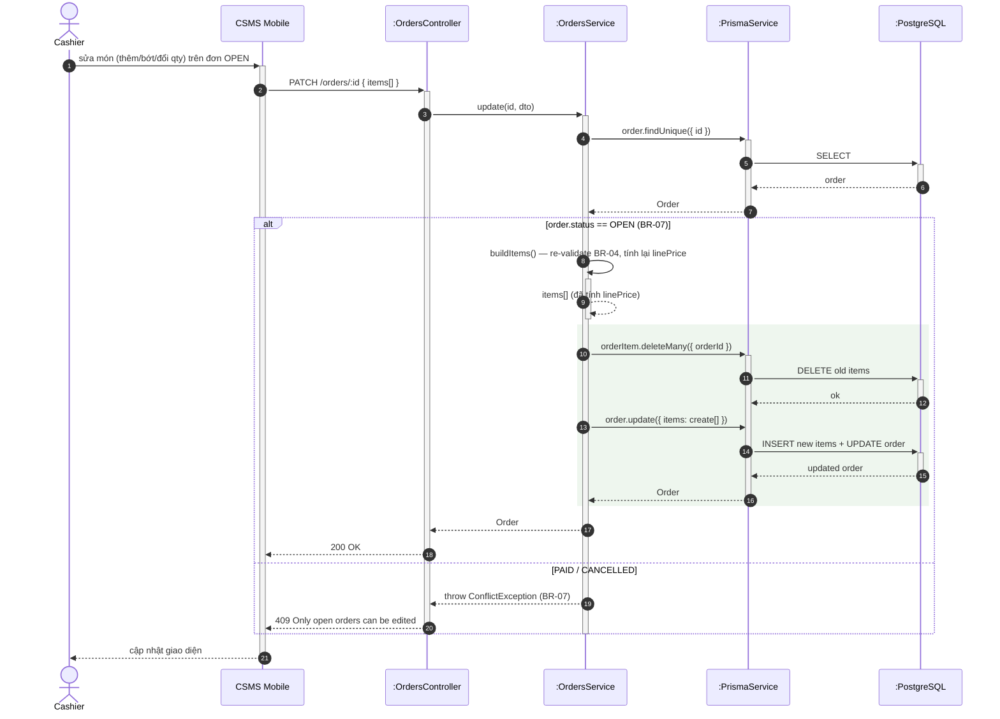
```mermaid
sequenceDiagram
    autonumber
    actor C as Cashier
    participant App as CSMS Mobile
    participant API as :OrdersController
    participant SVC as :OrdersService
    participant ORM as :PrismaService
    participant DB as :PostgreSQL

    C->>+App: sửa món (thêm/bớt/đổi qty) trên đơn OPEN
    App->>+API: PATCH /orders/:id { items[] }
    API->>+SVC: update(id, dto)
    SVC->>+ORM: order.findUnique({ id })
    ORM->>+DB: SELECT
    DB-->>-ORM: order
    ORM-->>-SVC: Order

    alt order.status == OPEN (BR-07)
        SVC->>+SVC: buildItems() — re-validate BR-04, tính lại linePrice
        SVC-->>-SVC: items[] (đã tính linePrice)
        rect rgb(238,246,238)
            SVC->>+ORM: orderItem.deleteMany({ orderId })
            ORM->>+DB: DELETE old items
            DB-->>-ORM: ok
            SVC->>ORM: order.update({ items: create[] })
            ORM->>+DB: INSERT new items + UPDATE order
            DB-->>-ORM: updated order
            ORM-->>-SVC: Order
        end
        SVC-->>API: Order
        API-->>App: 200 OK
    else PAID / CANCELLED
        SVC-->>API: throw ConflictException (BR-07)
        API-->>App: 409 Only open orders can be edited
    end
    deactivate SVC
    deactivate API
    App-->>-C: cập nhật giao diện
```

---

## SD-05 · Cancel Order — `UC07`

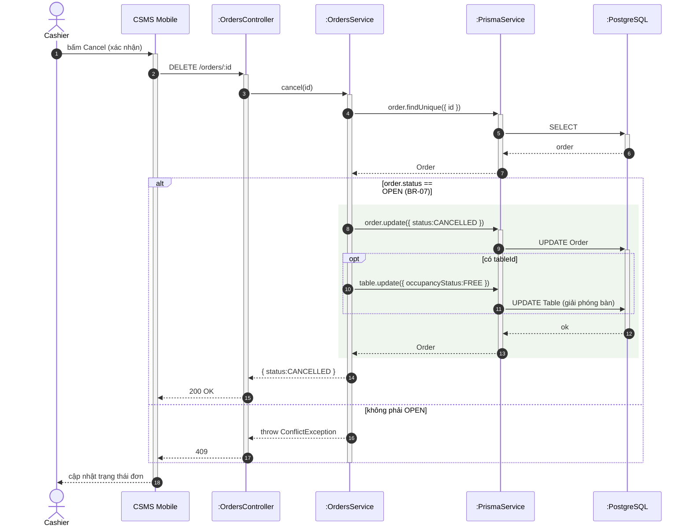
```mermaid
sequenceDiagram
    autonumber
    actor C as Cashier
    participant App as CSMS Mobile
    participant API as :OrdersController
    participant SVC as :OrdersService
    participant ORM as :PrismaService
    participant DB as :PostgreSQL

    C->>+App: bấm Cancel (xác nhận)
    App->>+API: DELETE /orders/:id
    API->>+SVC: cancel(id)
    SVC->>+ORM: order.findUnique({ id })
    ORM->>+DB: SELECT
    DB-->>-ORM: order
    ORM-->>-SVC: Order

    alt order.status == OPEN (BR-07)
        rect rgb(238,246,238)
            SVC->>+ORM: order.update({ status:CANCELLED })
            ORM->>+DB: UPDATE Order
            opt có tableId
                SVC->>ORM: table.update({ occupancyStatus:FREE })
                ORM->>DB: UPDATE Table (giải phóng bàn)
            end
            DB-->>-ORM: ok
            ORM-->>-SVC: Order
        end
        SVC-->>API: { status:CANCELLED }
        API-->>App: 200 OK
    else không phải OPEN
        SVC-->>API: throw ConflictException
        API-->>App: 409
    end
    deactivate SVC
    deactivate API
    App-->>-C: cập nhật trạng thái đơn
```

---

## SD-06 · Process Payment — `UC08`

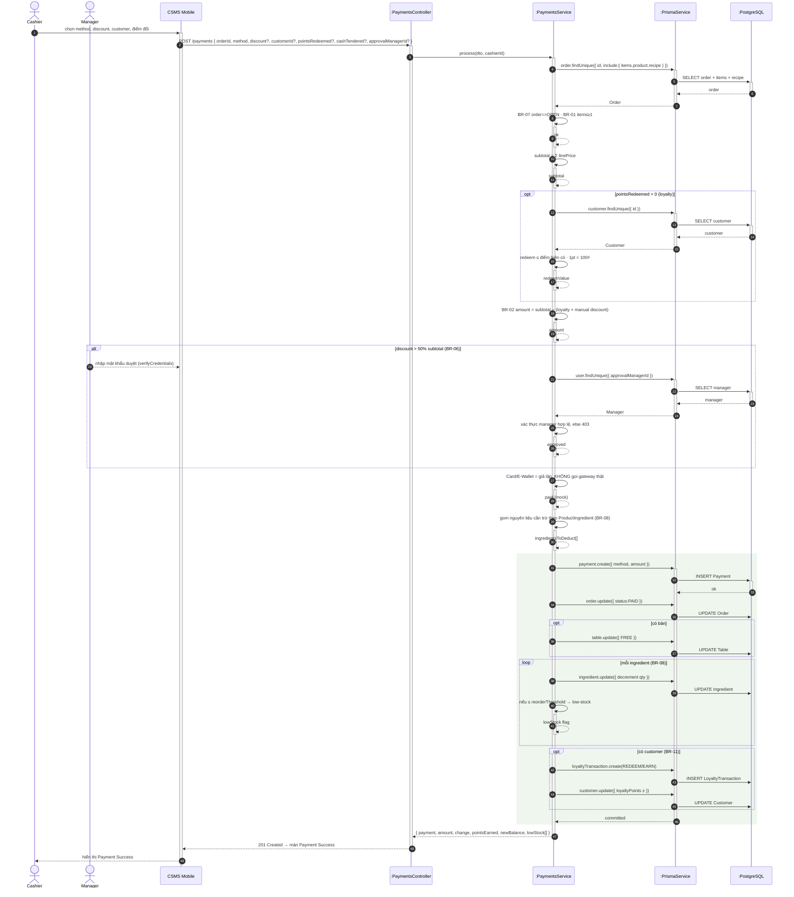
```mermaid
sequenceDiagram
    autonumber
    actor C as Cashier
    actor M as Manager
    participant App as CSMS Mobile
    participant API as :PaymentsController
    participant SVC as :PaymentsService
    participant ORM as :PrismaService
    participant DB as :PostgreSQL

    C->>+App: chọn method, discount, customer, điểm đổi
    App->>+API: POST /payments { orderId, method, discount?, customerId?, pointsRedeemed?, cashTendered?, approvalManagerId? }
    API->>+SVC: process(dto, cashierId)

    SVC->>+ORM: order.findUnique({ id, include:{ items.product.recipe } })
    ORM->>+DB: SELECT order + items + recipe
    DB-->>-ORM: order
    ORM-->>-SVC: Order
    SVC->>+SVC: BR-07 order==OPEN · BR-01 items≥1
    SVC-->>-SVC: ok
    SVC->>+SVC: subtotal = Σ linePrice
    SVC-->>-SVC: subtotal

    opt pointsRedeemed > 0 (loyalty)
        SVC->>+ORM: customer.findUnique({ id })
        ORM->>+DB: SELECT customer
        DB-->>-ORM: customer
        ORM-->>-SVC: Customer
        SVC->>+SVC: redeem ≤ điểm hiện có · 1pt = 100₫
        SVC-->>-SVC: redeemValue
    end
    SVC->>+SVC: BR-02 amount = subtotal − (loyalty + manual discount)
    SVC-->>-SVC: amount

    alt discount > 50% subtotal (BR-06)
        M-->>App: nhập mật khẩu duyệt (verifyCredentials)
        SVC->>+ORM: user.findUnique({ approvalManagerId })
        ORM->>+DB: SELECT manager
        DB-->>-ORM: manager
        ORM-->>-SVC: Manager
        SVC->>+SVC: xác thực manager hợp lệ, else 403
        SVC-->>-SVC: approved
    end

    SVC->>+SVC: Card/E-Wallet = giả lập, KHÔNG gọi gateway thật
    SVC-->>-SVC: paid (mock)
    SVC->>+SVC: gom nguyên liệu cần trừ theo ProductIngredient (BR-08)
    SVC-->>-SVC: ingredientsToDeduct[]

    rect rgb(238,246,238)
        SVC->>+ORM: payment.create({ method, amount })
        ORM->>+DB: INSERT Payment
        DB-->>-ORM: ok
        SVC->>ORM: order.update({ status:PAID })
        ORM->>DB: UPDATE Order
        opt có bàn
            SVC->>ORM: table.update({ FREE })
            ORM->>DB: UPDATE Table
        end
        loop mỗi ingredient (BR-08)
            SVC->>ORM: ingredient.update({ decrement qty })
            ORM->>DB: UPDATE Ingredient
            SVC->>+SVC: nếu ≤ reorderThreshold → low-stock
            SVC-->>-SVC: lowStock flag
        end
        opt có customer (BR-11)
            SVC->>ORM: loyaltyTransaction.create(REDEEM/EARN)
            ORM->>DB: INSERT LoyaltyTransaction
            SVC->>ORM: customer.update({ loyaltyPoints ± })
            ORM->>DB: UPDATE Customer
        end
        ORM-->>-SVC: committed
    end
    SVC-->>-API: { payment, amount, change, pointsEarned, newBalance, lowStock[] }
    API-->>-App: 201 Created → màn Payment Success
    App-->>-C: hiển thị Payment Success
```

---

## SD-07 · View Order Queue — `UC09`

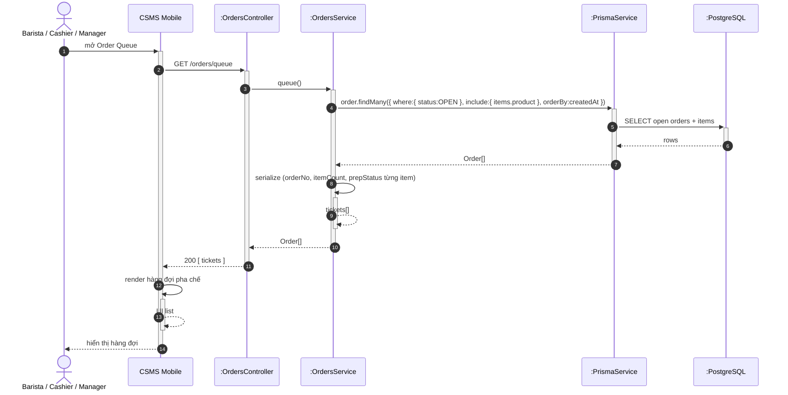
```mermaid
sequenceDiagram
    autonumber
    actor B as Barista / Cashier / Manager
    participant App as CSMS Mobile
    participant API as :OrdersController
    participant SVC as :OrdersService
    participant ORM as :PrismaService
    participant DB as :PostgreSQL

    B->>+App: mở Order Queue
    App->>+API: GET /orders/queue
    API->>+SVC: queue()
    SVC->>+ORM: order.findMany({ where:{ status:OPEN }, include:{ items.product }, orderBy:createdAt })
    ORM->>+DB: SELECT open orders + items
    DB-->>-ORM: rows
    ORM-->>-SVC: Order[]
    SVC->>+SVC: serialize (orderNo, itemCount, prepStatus từng item)
    SVC-->>-SVC: tickets[]
    SVC-->>-API: Order[]
    API-->>-App: 200 [ tickets ]
    App->>+App: render hàng đợi pha chế
    App-->>-App: UI list
    App-->>-B: hiển thị hàng đợi
```

---

## SD-08 · Update Item Prep Status — `UC09 (prep flow)`

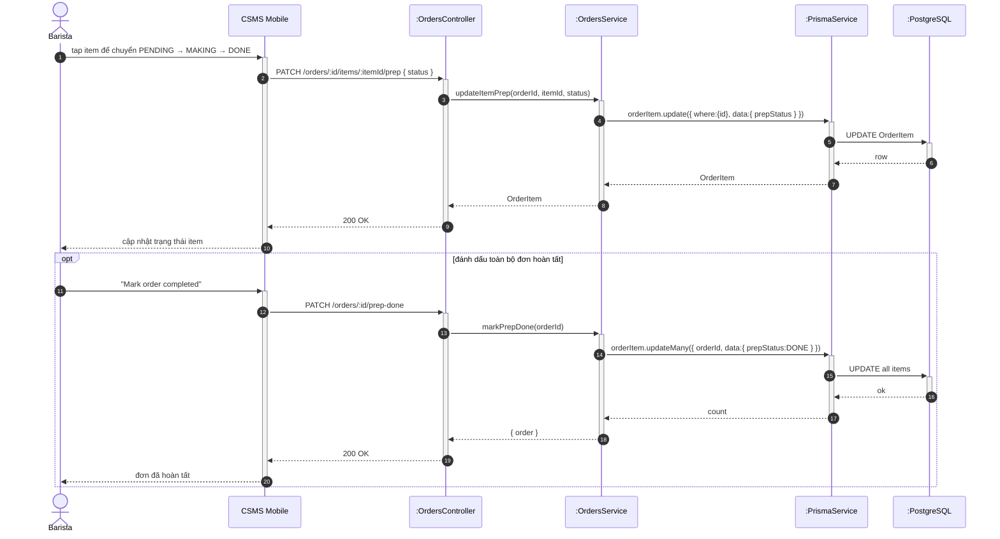
```mermaid
sequenceDiagram
    autonumber
    actor B as Barista
    participant App as CSMS Mobile
    participant API as :OrdersController
    participant SVC as :OrdersService
    participant ORM as :PrismaService
    participant DB as :PostgreSQL

    B->>+App: tap item để chuyển PENDING → MAKING → DONE
    App->>+API: PATCH /orders/:id/items/:itemId/prep { status }
    API->>+SVC: updateItemPrep(orderId, itemId, status)
    SVC->>+ORM: orderItem.update({ where:{id}, data:{ prepStatus } })
    ORM->>+DB: UPDATE OrderItem
    DB-->>-ORM: row
    ORM-->>-SVC: OrderItem
    SVC-->>-API: OrderItem
    API-->>-App: 200 OK
    App-->>-B: cập nhật trạng thái item

    opt đánh dấu toàn bộ đơn hoàn tất
        B->>+App: "Mark order completed"
        App->>+API: PATCH /orders/:id/prep-done
        API->>+SVC: markPrepDone(orderId)
        SVC->>+ORM: orderItem.updateMany({ orderId, data:{ prepStatus:DONE } })
        ORM->>+DB: UPDATE all items
        DB-->>-ORM: ok
        ORM-->>-SVC: count
        SVC-->>-API: { order }
        API-->>-App: 200 OK
        App-->>-B: đơn đã hoàn tất
    end
```

---

## SD-09 · Manage Product (Add / Edit / Delete / View) — `UC10`

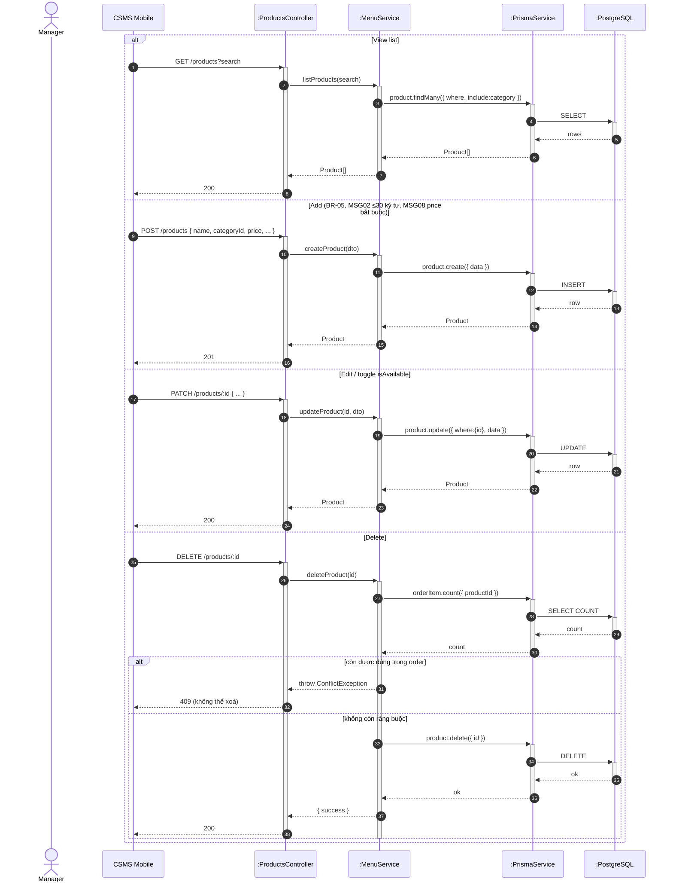
```mermaid
sequenceDiagram
    autonumber
    actor M as Manager
    participant App as CSMS Mobile
    participant API as :ProductsController
    participant SVC as :MenuService
    participant ORM as :PrismaService
    participant DB as :PostgreSQL

    alt View list
        App->>+API: GET /products?search
        API->>+SVC: listProducts(search)
        SVC->>+ORM: product.findMany({ where, include:category })
        ORM->>+DB: SELECT
        DB-->>-ORM: rows
        ORM-->>-SVC: Product[]
        SVC-->>-API: Product[]
        API-->>-App: 200
    else Add (BR-05, MSG02 ≤30 ký tự, MSG08 price bắt buộc)
        App->>+API: POST /products { name, categoryId, price, ... }
        API->>+SVC: createProduct(dto)
        SVC->>+ORM: product.create({ data })
        ORM->>+DB: INSERT
        DB-->>-ORM: row
        ORM-->>-SVC: Product
        SVC-->>-API: Product
        API-->>-App: 201
    else Edit / toggle isAvailable
        App->>+API: PATCH /products/:id { ... }
        API->>+SVC: updateProduct(id, dto)
        SVC->>+ORM: product.update({ where:{id}, data })
        ORM->>+DB: UPDATE
        DB-->>-ORM: row
        ORM-->>-SVC: Product
        SVC-->>-API: Product
        API-->>-App: 200
    else Delete
        App->>+API: DELETE /products/:id
        API->>+SVC: deleteProduct(id)
        SVC->>+ORM: orderItem.count({ productId })
        ORM->>+DB: SELECT COUNT
        DB-->>-ORM: count
        ORM-->>-SVC: count
        alt còn được dùng trong order
            SVC-->>API: throw ConflictException
            API-->>App: 409 (không thể xoá)
        else không còn ràng buộc
            SVC->>+ORM: product.delete({ id })
            ORM->>+DB: DELETE
            DB-->>-ORM: ok
            ORM-->>-SVC: ok
            SVC-->>API: { success }
            API-->>App: 200
        end
        deactivate SVC
        deactivate API
    end
```

---

## SD-10 · Manage Category (Add / Edit / Delete) — `UC11`

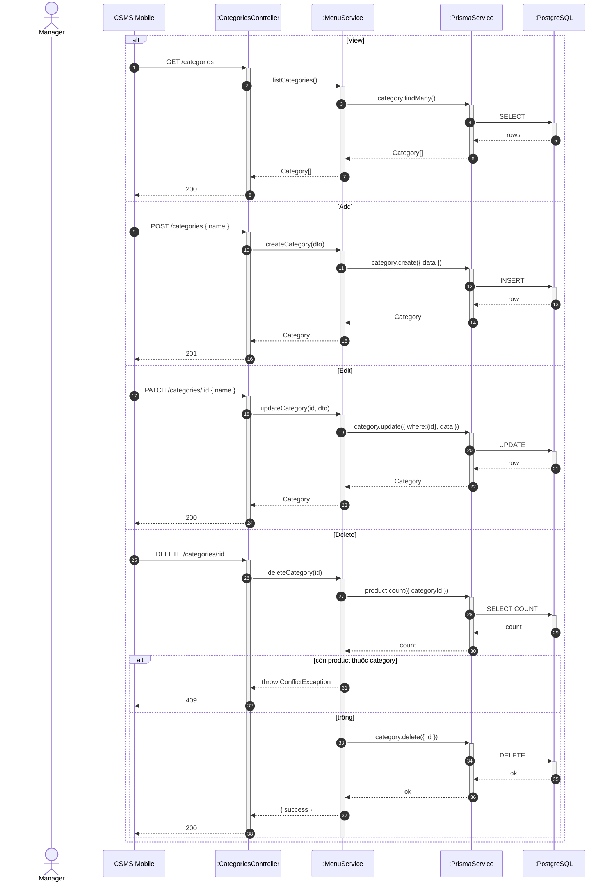
```mermaid
sequenceDiagram
    autonumber
    actor M as Manager
    participant App as CSMS Mobile
    participant API as :CategoriesController
    participant SVC as :MenuService
    participant ORM as :PrismaService
    participant DB as :PostgreSQL

    alt View
        App->>+API: GET /categories
        API->>+SVC: listCategories()
        SVC->>+ORM: category.findMany()
        ORM->>+DB: SELECT
        DB-->>-ORM: rows
        ORM-->>-SVC: Category[]
        SVC-->>-API: Category[]
        API-->>-App: 200
    else Add
        App->>+API: POST /categories { name }
        API->>+SVC: createCategory(dto)
        SVC->>+ORM: category.create({ data })
        ORM->>+DB: INSERT
        DB-->>-ORM: row
        ORM-->>-SVC: Category
        SVC-->>-API: Category
        API-->>-App: 201
    else Edit
        App->>+API: PATCH /categories/:id { name }
        API->>+SVC: updateCategory(id, dto)
        SVC->>+ORM: category.update({ where:{id}, data })
        ORM->>+DB: UPDATE
        DB-->>-ORM: row
        ORM-->>-SVC: Category
        SVC-->>-API: Category
        API-->>-App: 200
    else Delete
        App->>+API: DELETE /categories/:id
        API->>+SVC: deleteCategory(id)
        SVC->>+ORM: product.count({ categoryId })
        ORM->>+DB: SELECT COUNT
        DB-->>-ORM: count
        ORM-->>-SVC: count
        alt còn product thuộc category
            SVC-->>API: throw ConflictException
            API-->>App: 409
        else trống
            SVC->>+ORM: category.delete({ id })
            ORM->>+DB: DELETE
            DB-->>-ORM: ok
            ORM-->>-SVC: ok
            SVC-->>API: { success }
            API-->>App: 200
        end
        deactivate SVC
        deactivate API
    end
```

---

## SD-11 · Manage Ingredient (Add / Edit / Delete) — `UC12`

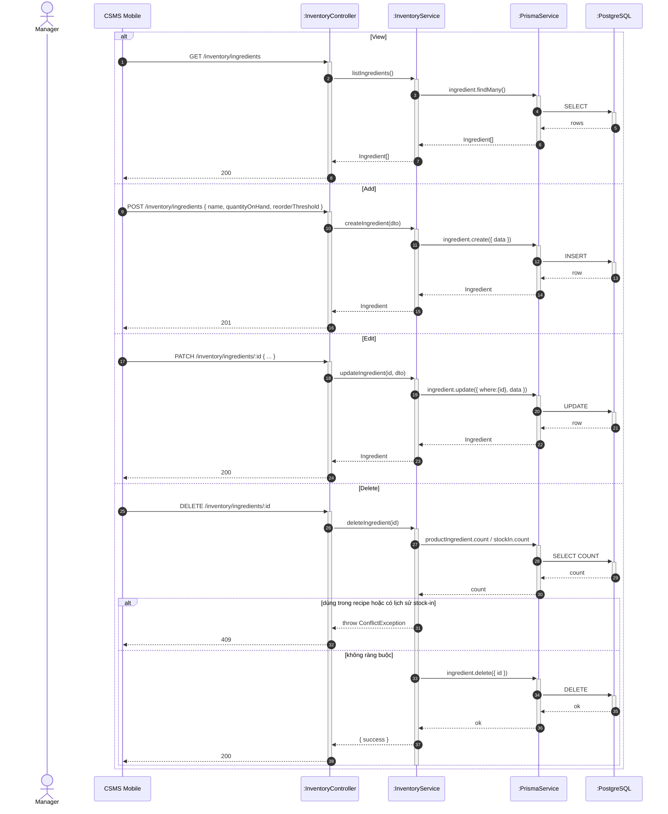
```mermaid
sequenceDiagram
    autonumber
    actor M as Manager
    participant App as CSMS Mobile
    participant API as :InventoryController
    participant SVC as :InventoryService
    participant ORM as :PrismaService
    participant DB as :PostgreSQL

    alt View
        App->>+API: GET /inventory/ingredients
        API->>+SVC: listIngredients()
        SVC->>+ORM: ingredient.findMany()
        ORM->>+DB: SELECT
        DB-->>-ORM: rows
        ORM-->>-SVC: Ingredient[]
        SVC-->>-API: Ingredient[]
        API-->>-App: 200
    else Add
        App->>+API: POST /inventory/ingredients { name, quantityOnHand, reorderThreshold }
        API->>+SVC: createIngredient(dto)
        SVC->>+ORM: ingredient.create({ data })
        ORM->>+DB: INSERT
        DB-->>-ORM: row
        ORM-->>-SVC: Ingredient
        SVC-->>-API: Ingredient
        API-->>-App: 201
    else Edit
        App->>+API: PATCH /inventory/ingredients/:id { ... }
        API->>+SVC: updateIngredient(id, dto)
        SVC->>+ORM: ingredient.update({ where:{id}, data })
        ORM->>+DB: UPDATE
        DB-->>-ORM: row
        ORM-->>-SVC: Ingredient
        SVC-->>-API: Ingredient
        API-->>-App: 200
    else Delete
        App->>+API: DELETE /inventory/ingredients/:id
        API->>+SVC: deleteIngredient(id)
        SVC->>+ORM: productIngredient.count / stockIn.count
        ORM->>+DB: SELECT COUNT
        DB-->>-ORM: count
        ORM-->>-SVC: count
        alt dùng trong recipe hoặc có lịch sử stock-in
            SVC-->>API: throw ConflictException
            API-->>App: 409
        else không ràng buộc
            SVC->>+ORM: ingredient.delete({ id })
            ORM->>+DB: DELETE
            DB-->>-ORM: ok
            ORM-->>-SVC: ok
            SVC-->>API: { success }
            API-->>App: 200
        end
        deactivate SVC
        deactivate API
    end
```

---

## SD-12 · Create Stock-In (Goods Receipt) — `UC13`

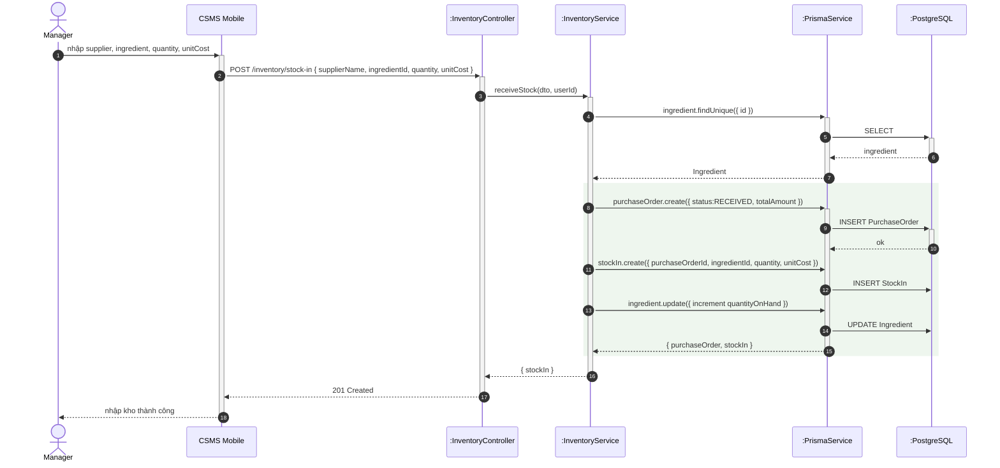
```mermaid
sequenceDiagram
    autonumber
    actor M as Manager
    participant App as CSMS Mobile
    participant API as :InventoryController
    participant SVC as :InventoryService
    participant ORM as :PrismaService
    participant DB as :PostgreSQL

    M->>+App: nhập supplier, ingredient, quantity, unitCost
    App->>+API: POST /inventory/stock-in { supplierName, ingredientId, quantity, unitCost }
    API->>+SVC: receiveStock(dto, userId)
    SVC->>+ORM: ingredient.findUnique({ id })
    ORM->>+DB: SELECT
    DB-->>-ORM: ingredient
    ORM-->>-SVC: Ingredient

    rect rgb(238,246,238)
        SVC->>+ORM: purchaseOrder.create({ status:RECEIVED, totalAmount })
        ORM->>+DB: INSERT PurchaseOrder
        DB-->>-ORM: ok
        SVC->>ORM: stockIn.create({ purchaseOrderId, ingredientId, quantity, unitCost })
        ORM->>DB: INSERT StockIn
        SVC->>ORM: ingredient.update({ increment quantityOnHand })
        ORM->>DB: UPDATE Ingredient
        ORM-->>-SVC: { purchaseOrder, stockIn }
    end
    SVC-->>-API: { stockIn }
    API-->>-App: 201 Created
    App-->>-M: nhập kho thành công
```

---

## SD-13 · View Inventory Report (+ Low-Stock) — `UC14`

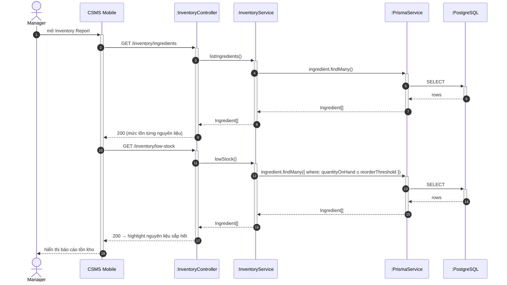
```mermaid
sequenceDiagram
    autonumber
    actor M as Manager
    participant App as CSMS Mobile
    participant API as :InventoryController
    participant SVC as :InventoryService
    participant ORM as :PrismaService
    participant DB as :PostgreSQL

    M->>+App: mở Inventory Report
    App->>+API: GET /inventory/ingredients
    API->>+SVC: listIngredients()
    SVC->>+ORM: ingredient.findMany()
    ORM->>+DB: SELECT
    DB-->>-ORM: rows
    ORM-->>-SVC: Ingredient[]
    SVC-->>-API: Ingredient[]
    API-->>-App: 200 (mức tồn từng nguyên liệu)

    App->>+API: GET /inventory/low-stock
    API->>+SVC: lowStock()
    SVC->>+ORM: ingredient.findMany({ where: quantityOnHand ≤ reorderThreshold })
    ORM->>+DB: SELECT
    DB-->>-ORM: rows
    ORM-->>-SVC: Ingredient[]
    SVC-->>-API: Ingredient[]
    API-->>-App: 200 → highlight nguyên liệu sắp hết
    App-->>-M: hiển thị báo cáo tồn kho
```

---

## SD-14 · Manage Table (Add / Edit / Delete) — `UC15`

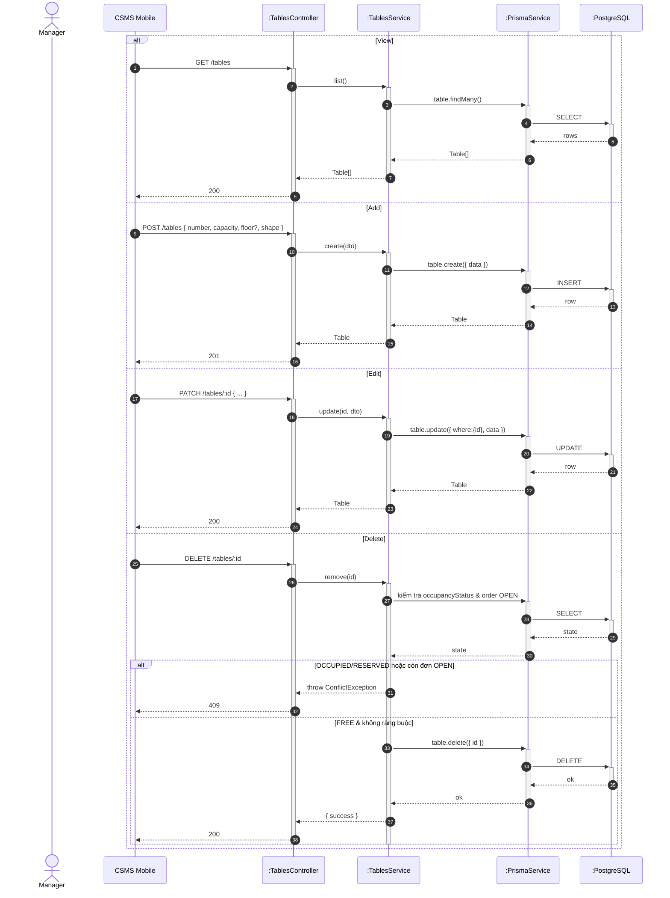
```mermaid
sequenceDiagram
    autonumber
    actor M as Manager
    participant App as CSMS Mobile
    participant API as :TablesController
    participant SVC as :TablesService
    participant ORM as :PrismaService
    participant DB as :PostgreSQL

    alt View
        App->>+API: GET /tables
        API->>+SVC: list()
        SVC->>+ORM: table.findMany()
        ORM->>+DB: SELECT
        DB-->>-ORM: rows
        ORM-->>-SVC: Table[]
        SVC-->>-API: Table[]
        API-->>-App: 200
    else Add
        App->>+API: POST /tables { number, capacity, floor?, shape }
        API->>+SVC: create(dto)
        SVC->>+ORM: table.create({ data })
        ORM->>+DB: INSERT
        DB-->>-ORM: row
        ORM-->>-SVC: Table
        SVC-->>-API: Table
        API-->>-App: 201
    else Edit
        App->>+API: PATCH /tables/:id { ... }
        API->>+SVC: update(id, dto)
        SVC->>+ORM: table.update({ where:{id}, data })
        ORM->>+DB: UPDATE
        DB-->>-ORM: row
        ORM-->>-SVC: Table
        SVC-->>-API: Table
        API-->>-App: 200
    else Delete
        App->>+API: DELETE /tables/:id
        API->>+SVC: remove(id)
        SVC->>+ORM: kiểm tra occupancyStatus & order OPEN
        ORM->>+DB: SELECT
        DB-->>-ORM: state
        ORM-->>-SVC: state
        alt OCCUPIED/RESERVED hoặc còn đơn OPEN
            SVC-->>API: throw ConflictException
            API-->>App: 409
        else FREE & không ràng buộc
            SVC->>+ORM: table.delete({ id })
            ORM->>+DB: DELETE
            DB-->>-ORM: ok
            ORM-->>-SVC: ok
            SVC-->>API: { success }
            API-->>App: 200
        end
        deactivate SVC
        deactivate API
    end
```

---

## SD-15 · Manage Customer (Add / Edit / Delete / View) — `UC16`

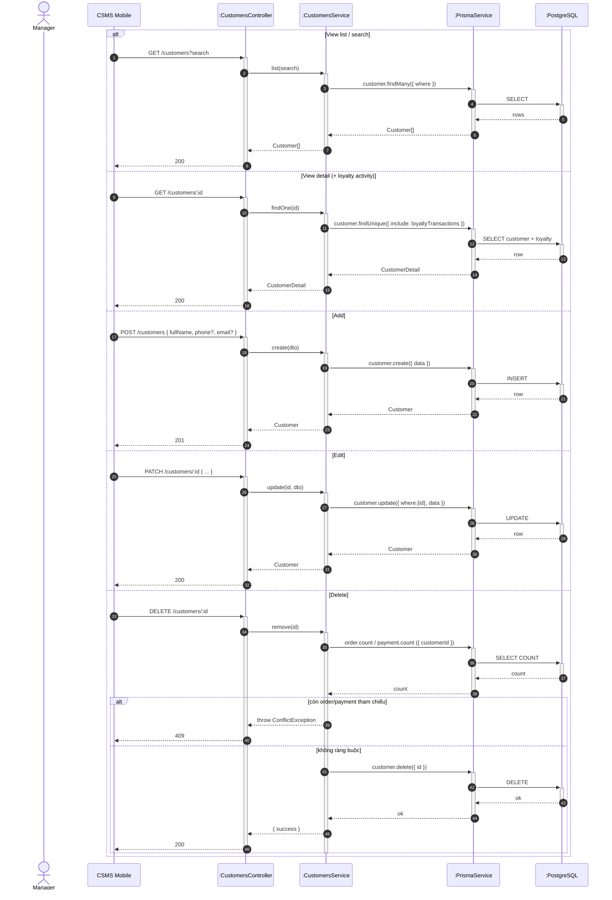
```mermaid
sequenceDiagram
    autonumber
    actor M as Manager
    participant App as CSMS Mobile
    participant API as :CustomersController
    participant SVC as :CustomersService
    participant ORM as :PrismaService
    participant DB as :PostgreSQL

    alt View list / search
        App->>+API: GET /customers?search
        API->>+SVC: list(search)
        SVC->>+ORM: customer.findMany({ where })
        ORM->>+DB: SELECT
        DB-->>-ORM: rows
        ORM-->>-SVC: Customer[]
        SVC-->>-API: Customer[]
        API-->>-App: 200
    else View detail (+ loyalty activity)
        App->>+API: GET /customers/:id
        API->>+SVC: findOne(id)
        SVC->>+ORM: customer.findUnique({ include: loyaltyTransactions })
        ORM->>+DB: SELECT customer + loyalty
        DB-->>-ORM: row
        ORM-->>-SVC: CustomerDetail
        SVC-->>-API: CustomerDetail
        API-->>-App: 200
    else Add
        App->>+API: POST /customers { fullName, phone?, email? }
        API->>+SVC: create(dto)
        SVC->>+ORM: customer.create({ data })
        ORM->>+DB: INSERT
        DB-->>-ORM: row
        ORM-->>-SVC: Customer
        SVC-->>-API: Customer
        API-->>-App: 201
    else Edit
        App->>+API: PATCH /customers/:id { ... }
        API->>+SVC: update(id, dto)
        SVC->>+ORM: customer.update({ where:{id}, data })
        ORM->>+DB: UPDATE
        DB-->>-ORM: row
        ORM-->>-SVC: Customer
        SVC-->>-API: Customer
        API-->>-App: 200
    else Delete
        App->>+API: DELETE /customers/:id
        API->>+SVC: remove(id)
        SVC->>+ORM: order.count / payment.count ({ customerId })
        ORM->>+DB: SELECT COUNT
        DB-->>-ORM: count
        ORM-->>-SVC: count
        alt còn order/payment tham chiếu
            SVC-->>API: throw ConflictException
            API-->>App: 409
        else không ràng buộc
            SVC->>+ORM: customer.delete({ id })
            ORM->>+DB: DELETE
            DB-->>-ORM: ok
            ORM-->>-SVC: ok
            SVC-->>API: { success }
            API-->>App: 200
        end
        deactivate SVC
        deactivate API
    end
```

---

## SD-16 · View Sales Report + Export Report — `UC17, UC18`

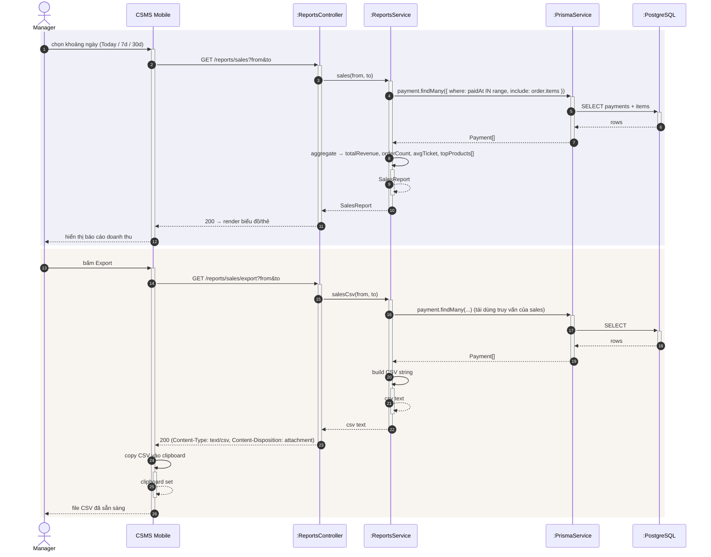
```mermaid
sequenceDiagram
    autonumber
    actor M as Manager
    participant App as CSMS Mobile
    participant API as :ReportsController
    participant SVC as :ReportsService
    participant ORM as :PrismaService
    participant DB as :PostgreSQL

    rect rgb(240,240,248)
        M->>+App: chọn khoảng ngày (Today / 7d / 30d)
        App->>+API: GET /reports/sales?from&to
        API->>+SVC: sales(from, to)
        SVC->>+ORM: payment.findMany({ where: paidAt IN range, include: order.items })
        ORM->>+DB: SELECT payments + items
        DB-->>-ORM: rows
        ORM-->>-SVC: Payment[]
        SVC->>+SVC: aggregate → totalRevenue, orderCount, avgTicket, topProducts[]
        SVC-->>-SVC: SalesReport
        SVC-->>-API: SalesReport
        API-->>-App: 200 → render biểu đồ/thẻ
        App-->>-M: hiển thị báo cáo doanh thu
    end

    rect rgb(248,244,240)
        M->>+App: bấm Export
        App->>+API: GET /reports/sales/export?from&to
        API->>+SVC: salesCsv(from, to)
        SVC->>+ORM: payment.findMany(...) (tái dùng truy vấn của sales)
        ORM->>+DB: SELECT
        DB-->>-ORM: rows
        ORM-->>-SVC: Payment[]
        SVC->>+SVC: build CSV string
        SVC-->>-SVC: csv text
        SVC-->>-API: csv text
        API-->>-App: 200 (Content-Type: text/csv, Content-Disposition: attachment)
        App->>+App: copy CSV vào clipboard
        App-->>-App: clipboard set
        App-->>-M: file CSV đã sẵn sàng
    end
```

---

*Nguồn: CSMS-SRS §2.2.2 (18 use case UC01–UC18) + codebase `backend/src/*` (routes/methods thực tế). SD-00 + 16 sequence diagram phủ đủ 18 UC (UC03 Authorize = bước «include» trong lane Controller). Cập nhật: 2026-07-05.*
