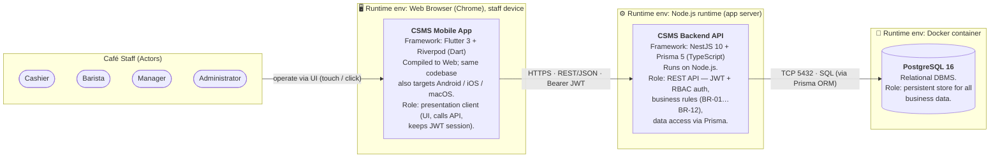
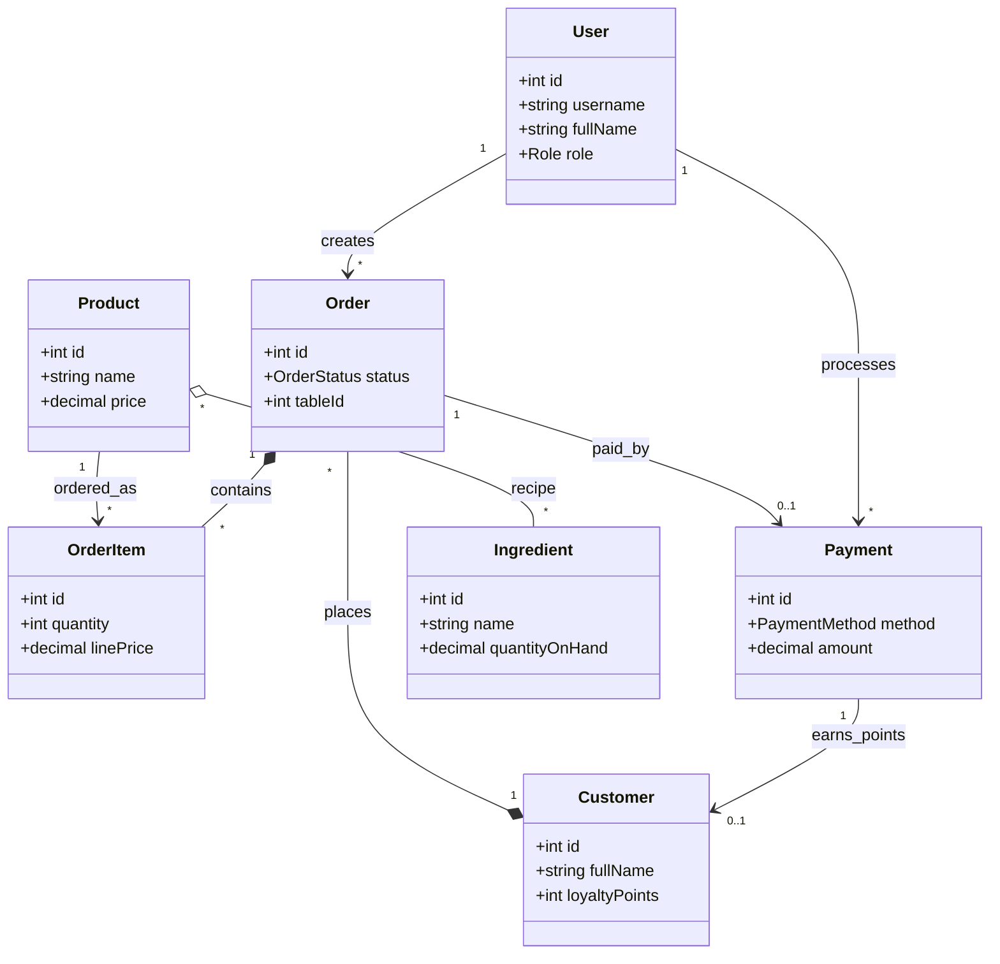
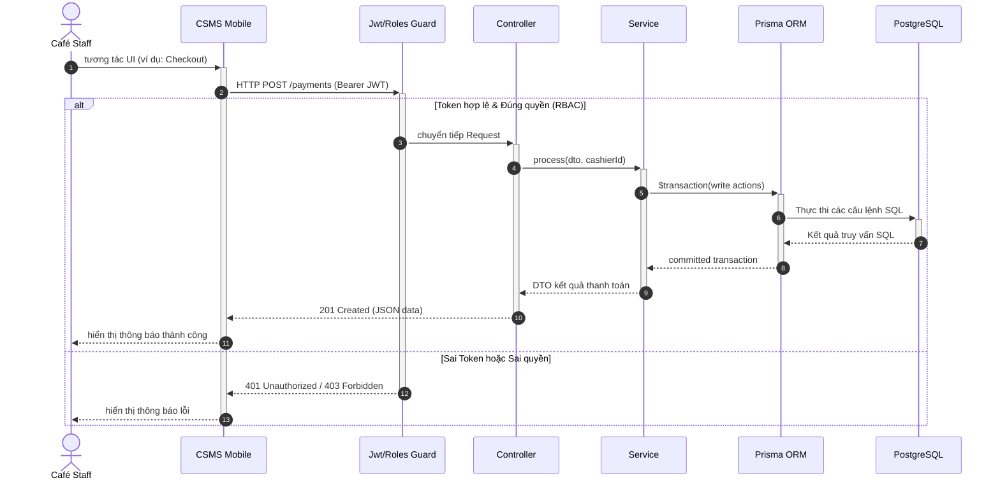
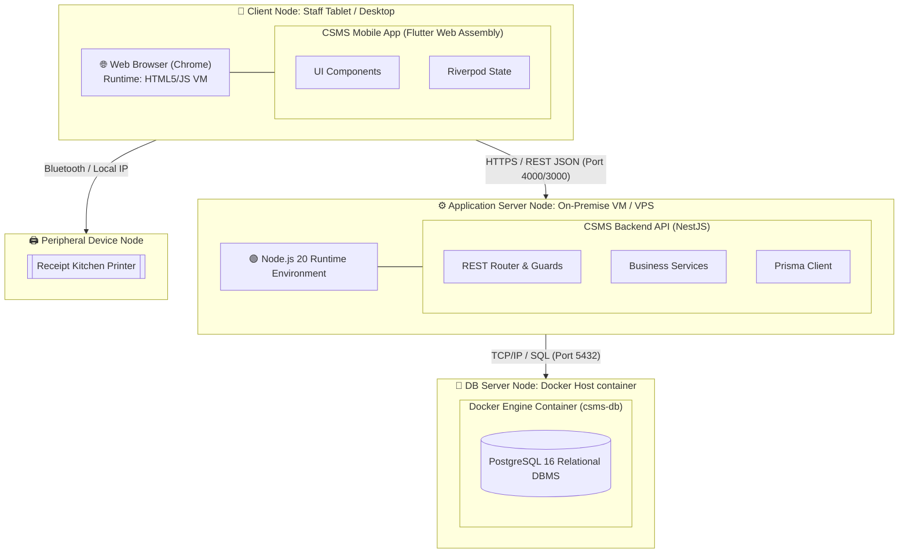

# II. Software Design Document — CSMS

## 1. System Design

### 1.1 System Architecture

CSMS uses a **3-tier client–server architecture** drawn in **box-and-line** style: rectangles are software components / runtime environments, dashed rectangles are the runtime host environments they run in, stick figures are the human actors that trigger the system, and every line is labelled with the **connection method** (protocol). The system has **2 software components** built by the team (Mobile App, Backend API) and **1 external system** (PostgreSQL DBMS).

> 📐 Editable diagram (draw.io): [`csms-architecture.drawio`](csms-architecture.drawio).

#### Overall architecture diagram

#### Explanation of the components

Each component is described by **what it is**, **its role**, and **the platform/environment it runs on** — as required.

| Component | Type | Runtime environment | Framework / Platform | Role (what it is & does) |
|-----------|------|---------------------|----------------------|--------------------------|
| **CSMS Mobile App** | Sub-system (client) | Web Browser (Chrome) on the staff device — the same codebase can also be built for Android, iOS and macOS | **Flutter 3 + Riverpod** (Dart) | Presentation client for café staff. Renders role-based UI (Cashier/Barista/Manager/Admin), captures user actions, calls the REST API, and keeps the JWT login session. Holds no core business logic. |
| **CSMS Backend API** | Sub-system (server) | **Node.js** runtime (application server) | **NestJS 10 + Prisma 5** (TypeScript) | REST API server. Handles authentication & authorization (JWT + role-based access control), enforces all business rules (BR-01…BR-12), and performs data access through the Prisma ORM within transactions. |
| **PostgreSQL 16** | External system (data store) | **Docker** container | PostgreSQL relational DBMS | Persistent storage for all business data (users, products, orders, payments, inventory, customers, loyalty). Accessed only by the Backend API. |

**Actors (who triggers the system):**

| Actor | Description |
|-------|-------------|
| **Cashier** | Creates orders, handles checkout, processes payments. |
| **Barista** | Views the preparation queue, updates item preparation status. |
| **Manager** | Manages menu, inventory, tables, customers; views reports; approves discounts. |
| **Administrator** | Manages user accounts, roles/permissions, and system configuration. |

**Connections between components (method / protocol):**

| Connection | Method / Protocol | Description |
|------------|-------------------|-------------|
| Actors → Mobile App | UI interaction (touch / click) | Staff log in and operate directly on the app in the browser. |
| Mobile App → Backend API | **HTTPS · REST / JSON · Bearer JWT** | Every business request carries an access token; the backend authenticates & authorizes before processing. |
| Backend API → PostgreSQL | **TCP (port 5432) · SQL via Prisma ORM** | Reads/writes data within transactions (`$transaction`) to keep operations atomic (e.g. payment + stock deduction + loyalty update). |

> 💳 **Scope note:** there is **no external payment gateway and no extra hardware device** in this version — Card/E-Wallet payments are mocked inside the Backend (pressing Confirm = PAID).

---

### 1.2 Package Diagram

See [`package-diagram.md`](package-diagram.md) and the diagram [`csms-package.drawio`](csms-package.drawio) — presented as the **Development View** of the 4+1 architecture model, split into Mobile and Backend, showing the layered architecture down to the source-file level.

---

## 2. 4+1 Architectural Views

### 2.1 Logical View (High-Level Domain Class Diagram)

Sơ đồ lớp mô tả cấu trúc dữ liệu miền (domain model) và mối quan hệ giữa các thực thể cốt lõi trong hệ thống:

### 2.2 Process View (High-Level Request-Response Flow)

Sơ đồ mô tả quy trình tương tác và giao tiếp giữa các tầng nghiệp vụ từ Client đến Database khi xử lý một request:

### 2.3 Deployment View (System Hardware/Runtime Nodes)

Sơ đồ mô tả cách phân bổ các thành phần phần mềm trên các nút phần cứng vật lý và các môi trường chạy ở runtime:

